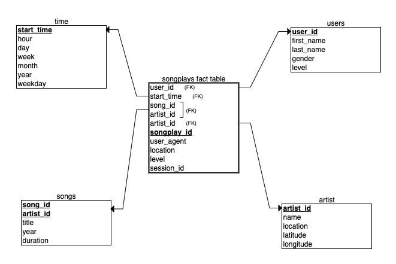
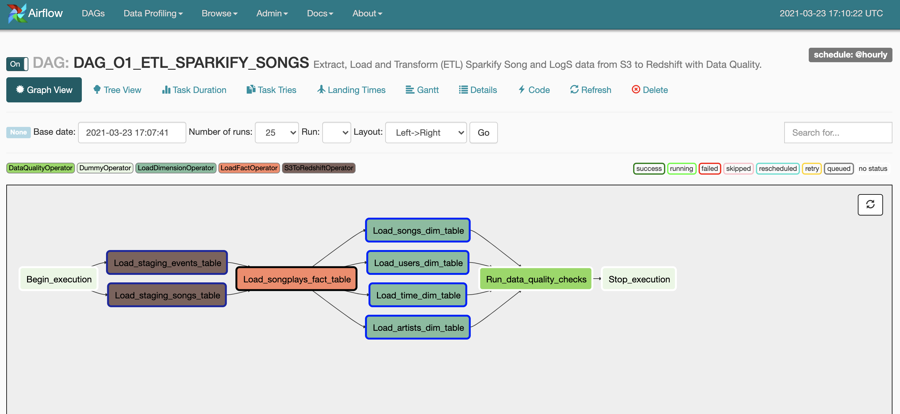
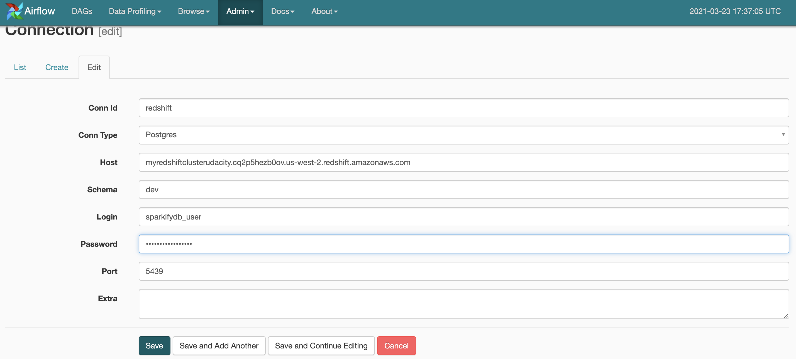
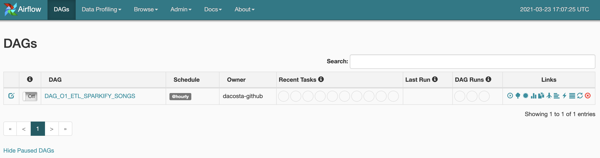

# Project: Data Pipelines with Airflow

_This repository contains the results of the "Data Pipelines with Airflow" Project which is part of the Udacity Data Engineering Nanodegree._

## Introduction
A music streaming company, Sparkify, has decided that it is time to introduce more automation and monitoring to their data warehouse ETL pipelines and come to the conclusion that the best tool to achieve this is Apache Airflow.

They have decided to bring you into the project and expect you to create high grade data pipelines that are dynamic and built from reusable tasks, can be monitored, and allow easy backfills. They have also noted that the data quality plays a big part when analyses are executed on top the data warehouse and want to run tests against their datasets after the ETL steps have been executed to catch any discrepancies in the datasets.

The source data resides in S3 and needs to be processed in Sparkify's data warehouse in Amazon Redshift. The source datasets consist of JSON logs that tell about user activity in the application and JSON metadata about the songs the users listen to.

## Project Description
In this project, I created own custom operators to perform tasks such as staging the data, filling the data warehouse, and running checks on the data as the final step.

We have provided you with a project template that takes care of all the imports and provides four empty operators that need to be implemented into functional pieces of a data pipeline. The template also contains a set of tasks that need to be linked to achieve a coherent and sensible data flow within the pipeline.

A helpers class has been provided that contains all SQL transformations. Thus, I did not need to write the ETL, but rather run it with the custom operators.


## Data
I worked with two datasets that reside in S3. Here are the S3 links for each:

* Song data: ```s3://udacity-dend/song_data```
* Log data: ```s3://udacity-dend/log_data```

The data sources (available in S3), shared by Sparkify, are the following:

### Song Dataset
The first dataset is a subset of real data from the Million Song Dataset. Each file is in JSON format and contains metadata about a song and the artist of that song. The files are partitioned by the first three letters of each song's track ID. For example, here are filepaths to two files in this dataset.

```
song_data/A/B/C/TRABCEI128F424C983.json
song_data/A/A/B/TRAABJL12903CDCF1A.json
```

And below is an example of what a single song file, TRAABJL12903CDCF1A.json, looks like.

```json
{ "num_songs": 1, "artist_id": "ARJIE2Y1187B994AB7", "artist_latitude": null, "artist_longitude": null, "artist_location": "", "artist_name": "Line Renaud", "song_id": "SOUPIRU12A6D4FA1E1", "title": "Der Kleine Dompfaff", "duration": 152.92036, "year": 0 }
```

### Log Dataset
The second dataset consists of log files in JSON format generated by this [event simulator](https://github.com/Interana/eventsim) based on the songs in the dataset above. These simulate activity logs from a music streaming app based on specified configurations.

The log files in the dataset are partitioned by year and month. For example, here are filepaths to two files in this dataset.

```
log_data/2018/11/2018-11-12-events.json
log_data/2018/11/2018-11-13-events.json
```

And below is an example of what the data in a log file, 2018-11-12-events.json, looks like.


<br/>

## Schema for Song Play Analysis
Using the song and log datasets, I created a **star schema** data warehouse optimized for queries on song play analysis. It has one **Fact** table having business data, and supporting **Dimension** tables. Database schema is the following:

* Sparkify analytics database named `sparkifydb`



<br/>

This model, includes the following tables:

### Fact Table
`songplays` - ecords in event data associated with song plays i.e. records with page `NextSong`.  
    
    songplay_id, start_time, user_id, level, song_id, artist_id, session_id, location, user_agent

<br/>

### Dimension Tables
`users` - users in the app.
    
    user_id, first_name, last_name, gender, level

`songs` - songs in music database.

    song_id, title, artist_id, year, duration

`artists` - artists in music database.
    
    artist_id, name, location, latitude, longitude

`time` - timestamps of records in **songplays** broken down into specific units.

    start_time, hour, day, week, month, year, weekday


<br/>

Principal advantages of using this Star Schema:

* Denormalized tables
* Easy for Sparkify users to understand
* Query performance
* Fast aggregation

The above schema allows in a very quick and easy way to obtain aggregations to answer different questions such as: what songs users are listening to? what songs are most heard? what is the duration? which users listen to these songs? which are the artists? etc...).

<br/>

## ETL Process

### Airflow

"Airflow is a platform to programmatically author, schedule and monitor workflows.

Use Airflow to author workflows as Directed Acyclic Graphs (DAGs) of tasks. The Airflow scheduler executes your tasks on an array of workers while following the specified dependencies. Rich command line utilities make performing complex surgeries on DAGs a snap. The rich user interface makes it easy to visualize pipelines running in production, monitor progress, and troubleshoot issues when needed.

When workflows are defined as code, they become more maintainable, versionable, testable, and collaborative" [1].

<br/>

### Airflow UI

In Airflow's graphical environment, it is possible to visualize all phases of the workflow (DAG) of the ETL process (Pipeline) created to extract and load data.



    Note: in this project I used Airflow available in udacity's workstation. However, when I migrated the solution to mine here I chose to also migrate the Airflow solution to apache-airflow==2.0.1. 

<br/>

### ETL Description

The ETL process is composed of four phases:

`1. Staging phase` - here the data are stored in staging tables, before being loaded into the final model. This phase allows the several files to be uploaded into an structure so that they can be worked on in the future.

Have two staging tables which copy the JSON file inside the AWS S3 buckets:

* `staging_events` - event data about what users have done.
    
        event_id, artist, auth, first_name, gender, item_in_session, last_name, length,level, location method, page, registration, session_id, song, status, ts, user_agent, user_id

* `staging_songs` - song data about songs and artists.

        artist_id, artist_latitude, artist_longitude, artist_location , artist_name, song_id, title, year, num_songs, duration 

`2. Fact phase` the data are worked on and loaded into this structure, so that they can be analysed from different perspectives (dimension).       

`3. Dimension phase` of transformation and loading of dimension tables. 

`4. Data Quality phase` the last phase of the process that evaluates the quality (in quantity) of the data that has been processed in the pipeline.

<br/>

### ETL Pipeline

1. create AWS Redshift cluster (local python)
2. create data structure if it doesn't exist on the AWS Redshift cluster (local sql + python)
3. load data from S3 to staging tables on AWS Redshift (airflow)
4. load data from staging tables to analytics tables (dimensions and fact tables) on AWS Redshift (airflow)
5. run the data quality processes (airflow)
6. running the analytic queries on AWS Redshift database to compare results (data quality and notebook analysis) (notebook)
7. delete AWS Redshift cluster (local python)

<br/>

### Airflow DAG executes the following steps:

1. copy source data from S3 to staging tables
2. transform data from staging tables to fact table and dimension tables
3. run data quality checks to ensure that all data in fact table and dimension tables is correct and clean

Output: input JSON data is processed and analysed data is written into fact and dimensions tables in AWS Redshift.

<br/>

## Project repository structure
The following folders and files are contained in the project repository:

```
. aws-data-warehouse-modeling
|
│   README.md                          # Project description and documentation
│   .gitignore                         # Files and extension ignored in commited
│   docker-compose.yml                 # Container for several tools
│   requirements.txt                   # Python requirements and libraries
└───data                               # Locally data source (files) and generated new files 
└───resources                          # Project resources (images, others...)
│     └─── images                      # Images about process
└───notebooks                          # Jupyter notebooks
│     └─── analysis_aws_data.ipynb     # Jupyter notebook for analysis data
└───src                                # Source code
│   └─── scripts                       # Python code
│       │__ create_aws_cluster.py      # Python code to create AWS cluster
│       │__ create_tables.py           # Python code to create database
│       │__ delete_aws_cluster.py      # Python code to delete AWS cluster
│       │__ dwh.cfg                    # Configuration file, credentials for AWS account
│       └── sql_queries.py             # Python code to SQL Statments
|   └───airflow                        # Airflow home
|       |               
│       └───dags                       # Airflow DAGs
│           │__ DAG_O1_ETL_SPARKIFY_SONGS.py  # DAG definition
|       └───plugins
│           │  
|           └───helpers
|               │__ sql_queries.py     # All sql queries needed
|           └───operators
|               │__ data_quality.py    # DataQualityOperator
|               │__ load_dimension.py  # LoadDimensionOperator
|               │__ load_fact.py       # LoadFactOperator
|               │__ load_from_s3_to_redshift.py  # StageToRedshiftOperator
└──    
```

<br/>

The main files:
* `create_aws_cluster` this module provides all methods to interact with AWS Account. It contains the cluster and session creation methods, IAM Roles, VPC, EC2, Redshift and others.

* `delete_aws_cluster` this module provides all methods to interact with AWS. It contains the cluster and session deletion methods, IAM Roles, VPC, EC2, Redshift and others.

* `create_tables.py` this module provides all methods to interact with AWS Redshift cluster server. It contains the creation tables and data loading fact and dimension tables for the star schema in AWS Redshift.

* `sql_queries.py` this module contains all sql queries/statements, and it's used (imported) in other files or scripts.

* `load_from_s3_to_redshift.py` this module represents the operator to execute queries that allow copying the data from the source in S3 to the staging tables, in the redshift cluster.

* `load_fact.py` this module represents the operator to execute queries that allow loading the data from the staging tables to the fact tables, in the redshift cluster.

* `load_dimension.py` this module represents the operator to execute queries that allow loading the data from the staging tables to the dimensions tables, in the redshift cluster.

* `data_qualitty.py` this module represents the operator to execute queries that allow apply data quality rules (errors and validations) to the tables defined as dimensional and fact.


<br/>


## Requirements

The following tools and packages are necessary to run the scripts locally:

* Git
* Python3
    * boto3
    * pandas    
* Requirements *
* AWS Account
* AWS SDK for Python
* Docker
* Docker-Compose
    * _postgresql_
    * _airflow_
    * _redis_

* Python3 is recommended as the environment. The most convenient way to install python is to use Anaconda (https://www.anaconda.com/distribution/) either via GUI or command line.
* Apache Airflow (https://airflow.apache.org/start.html).
* Access to AWS S3 and AWS Redshift services (read and write credentials).
* AWS redshift cluster has been created and is running.

<br/>

## How to use the Repository (for running locally in your machine)

<br/>

**Clone repository**

``` bash
git clone https://github.com/dacosta-github/udacity-de.git 
```

<br/>

**Change directory to local repository**

```bash
cd apache-airflow-data-pipelines
```

<br/>

### Prepare the execution environment (Option 1)

_Note: must change in all files in the AIRFLOW_HOME reference the absolute and correct path to the airflow folder._

**Start airflow and postgres docker container**

_Run this command in new terminal window or tab_

```bash
docker-compose up
```

_check containers_
```bash
docker ps # run in new terminal
```

<br/>

**Create and active python virtual environment**

_Run these following commands in new terminal window or tab_
```bash
python3 -m venv venv            
source venv/bin/activate 
```

<br/>
   
**Install requirements**

```bash
python3 -m pip install --upgrade pip
pip install -r requirements.txt  
```

<br/>

### Prepare the execution environment (Option 2)

Create environment (virtual) and install the packages:

```bash
make install
```

Run Airflow:

```bash
sh start.sh
```

Once the virtual environment is set up and operational, you need permissions to the AWS environment.

### Prepare the execution local environment (Option 3)

Create environment (local) and install the packages:

```bash
make local
```

Run Airflow:

```bash
sh start.sh
```

<br/>

**Create a AWS Redshift Cluster scripts**

This step is very important, here I used AWS SDK for Python to interact with my AWS Account. To do this, it's first necessary to edit the configuration file with your admin credentials from the AWS account.

Note, if you don't have a user created as **admin**, please create a user so that you can perform the following processes. You can see how to create it [here](https://classroom.udacity.com/nanodegrees/nd027-ent/parts/c05b833c-a2b7-43a5-b2a9-6dcc7b0fe0d1/modules/e8a78a0c-5bb6-40e0-9904-57030d78ce46/lessons/53e6c5d3-c9bb-4938-9133-bf8c6bfad3da/concepts/ef0f5bdf-d5e2-461c-b375-fc0dd89ccb79):
1. Create IAM user (e.g. `dwhuser`)
2. Create IAM role (e.g. `dwhRole`) with `AmazonS3ReadOnlyAccess` access rights
get ARN

<br/>

**Edit `dwh.cfg` file**

To run the process you must first edit the `apache-airflow-data-pipelines/src/scripts/dwh.cfg` file with your settings. This file contains the configuration variables used in the scripts to create and configure AWS resources.

Below are the variables that the user needs to configure before running the scripts.

* **NAME** = `<ENTER AWS USER ADMIN NAME>`  # paste your User Name
* **AWS_ACCESS_KEY_ID** = `<ENTER AWS ACCESS KEY>`   # paste your user Access Key Id
* **AWS_SECRET_ACCESS_KEY** = `<ENTER AWS SECRET KEY>`  # paste your user Secret Access Key
* **REGION_NAME** = `<ENTER AWS REGION NAME>`  # paste your user Region Name
* **VPC_ID** = `<ENTER VPC ID>`  # paste the VPC_ID (If blank the first VPC on user's AWS account is considered)

`Never save and commited in your Github your AWS ACCESS KEY ID & AWS SECRET KEY on scripts!`


<br/>

**Run the create aws cluster scripts**
```bash
cd src
python3 -m create_aws_cluster   # create a aws redshift cluster, roles, ...
```

_Log obtained after execution:_
```
(venv) user@BGSN0003 scripts % python3 -m create_aws_cluster
IAM Role Created: my_redshift_role.
Security Group Created sg-49584345730453 in vpc vpc-53532344.
Creating cluster: redshift-udacity
Cluster status: creating
Database name: sparkifydb
Waiting for cluster to be created...
Cluster created.
Endpoint=redshift-udacity.popsdcweie.eu-west-2.redshift.amazonaws.com
Updatting CFG file...
CFG file Updated.
```

Confirm that the `dwh.cfg` file has been successfully updated.

_This step is important because the information related to the AWS Redshift host is required to configure the connection in Airflow._

<br/>

**Run the DDL scripts**

```bash
python3 -m create_tables # create database schema
```

_Log obtained after execution:_
```bash
(venv) user@BGSN0003 scripts % python3 -m create_tables
The cluster connection has been successfully established!
Dropping tables...
Creating tables...
The database schema was created with success.
```

<br/>

**Start Airflow**

_You should open the following link in your web browser:_

```bash
http://localhost:8080 # if you configure another port, change here
```

Credentials (default optaion 2 or option 3 - To option 1 read docker compose file):
* **Username**: `admin`
* **Password**: `admin`

<br/>

**Connect Airflow to AWS**

_Note: see the credentials in the file: `dwh.cfg`_

1. Click on the `Admin` tab and select `Connections`.
2. Under `Connections`, select `Create`.
3. On the create connection page, enter the following values:

    * `Conn Id`: Enter `aws_credentials`.
    * `Conn Type`: Enter `Amazon Web Services`.
    * `Login`: Enter your `Access key ID` from the IAM User credentials.
    * `Password`: Enter your `Secret access key` from the IAM User credentials .

4. Once you've entered these values, select `Save` and `Add Another`.
5. On the next create connection page, enter the following values for `redshift` connection and save:

    * `Conn Id`: Enter `redshift`
    * `Conn Type`: Enter `Postgres`.
    * `Host`: Enter the endpoint of your Redshift cluster.
    * `Schema`: Enter `dev`. 
    * `Login`: Enter the `sparkifydb_user` name.
    * `Password`: Enter the password `sparkifyDB_pass_1`.
    * `Port`: Enter `5439`.




<br/>

**Start the DAG**

1. Start the DAG by switching it state from OFF to ON.



2. Refresh the page and click on the `DAG_O1_ETL_SPARKIFY_SONGS` to view the current state.
3. The DAG is set to execute once an hour.
4. The whole DAG should take between 10 minutes and 20 minutes.


<br/>

**Exploring Airflow and DAGs**
<br/>

In Airflow you can access the DAG workflow and explore the status (log access) of each of the tasks. 


<br/>

**Check results**

_This command launches the **Jupyter Notebook** application and opens an installation in the browser automatically. Afterwards, you should navigate to the notebook folder and open the `analysis_aws_data.ipynb`. notebook later is able to run the code._

```bash
cd ..
cd notebooks
jupyter notebook     # http://127.0.0.1:8888/?token=XXXXXXXXXXXXXXX
```
<br/>

**Exploring the Jupyter Notebooks**
_You should open the following link in your web browser:_

```bash
http://localhost:5555/browser/    
```

After all validations you can delete the created environments (python and/or docker). To do this, use the following commands, for each option:

On the same terminal as the python env, execute:

```bash
ctrl+c # to close Jupyter Notebook instance, use Ctrl+C in the terminal
```

<br/>

**Deleting a AWS Redshift Cluster scripts**

```bash
cd src
cd scripts
python3 -m delete_aws_cluster  # delete a cluster, roles, ...
```
_Log obtained after execution:_
```
(venv) user@BGSN0003 scripts % python3 -m delete_aws_cluster
Deleting Redshift cluster: redshift-udacity
Redshift Cluster status: deleting
Waiting for Redshift cluster to be deleted...
Redshift Cluster deleted.
IAM Role 'my_redshift_role' does not exist!
Security Group deleted. 
```

**Cleaning virtual environment**

Option 1

```bash
cd ..
cd apache-airflow-data-pipelines
deactivate
rm -r venv
```

Option 2 or 3

```bash
cd apache-airflow-data-pipelines
sh stop.sh
```

If you have chosen to create the docker compose, on the same terminal as the docker, execute:

```bash
ctrl+c  # to close Docker Containers, use Ctrl+C in the terminal
```

```bash
docker ps
docker kill
docker system prune -a  # select y
```

```bash
docker volume ls
docker volume prune # select y
```

```bash
docker network ls
docker network prune  # select y
```

<br/>

## Acknowledgements

1. [Apache Airflow Documentation](https://airflow.apache.org/docs/apache-airflow/stable/index.html)
1.  [Apache/Airflow and PostgreSQL with Docker and Docker Compose](https://towardsdatascience.com/apache-airflow-and-postgresql-with-docker-and-docker-compose-5651766dfa96)
1.  How to run Apache Airflow with docker-compose [Quick guide](https://xnuinside.medium.com/quick-guide-how-to-run-apache-airflow-cluster-in-docker-compose-615eb8abd67a)
1. [Docker bitnami/airflow](https://hub.docker.com/r/bitnami/airflow/)
1. [Bitnami and Airflow](https://github.com/bitnami/bitnami-docker-airflow)
1. [Apache Airflow](https://towardsdatascience.com/tagged/apache-airflow)
1. [Create AWS Redshift cluster using AWS python SDK](https://shravan-kuchkula.github.io/create-aws-redshift-cluster/)
1. [Udacity rubric](https://review.udacity.com/#!/rubrics/2478/view)
1. [Data Warehouse with Redshift](https://github.com/drobim-data-engineering/Data-Warehouse-with-Redshift)
1. [Creating a Redshift Cluster Using AWS Python SDK](https://medium.com/nerd-for-tech/creating-a-redshift-cluster-using-with-aws-python-sdk-9ba51416473)
1. [Python Code Samples for Amazon Redshift](https://docs.aws.amazon.com/code-samples/latest/catalog/code-catalog-python-example_code-redshift.html)
1. [AWS Redshift Connector](https://github.com/aws/amazon-redshift-python-driver)
1. Songs data set on [million song dataset](http://millionsongdataset.com)

<br/>

