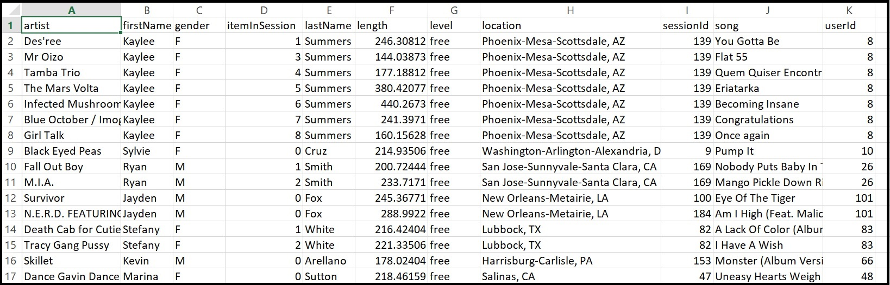

# Project: Data Modeling with Apache Cassandra

_This repository contains the results of the "Data Modelling with Apache Cassandra" Project which is part of the Udacity Data Engineering Nanodegree._

## Introduction
A startup called **Sparkify** wants to analyze the data they've been collecting on songs and user activity on their new music streaming app. The analytics team is particularly interested in understanding what songs users are listening to. Currently, they don't have an easy way to query the data to generate the results, since the data resides in a directory of CSV files on user activity on the app.

They'd like a data engineer to create a Apache Cassandra database with tables designed to optimize queries on song play analysis, and bring you on the project.


## Project Description
In this project, I will apply what I learned in data modelling with Apache Cassandra and build an ETL pipeline using Python. To complete the project, I defined the fact and dimension tables for a star scheme for a particular analytical focus, and write an ETL pipeline that transfers data from files in two local directories to these tables in Apache Cassandra using Python and SQL. I are provided with part of the ETL pipeline that transfers data from a set of CSV files within a directory to create a streamlined CSV file to model and insert data into Apache Cassandra tables.


## Data
The data sources (available locally), shared by Sparkify, are the following:

### Events Dataset
For this project, I'll be working with one dataset: `event_data`. The directory of CSV files partitioned by date. Here are examples of filepaths to two files in the dataset:

```
event_data/2018-11-08-events.csv
event_data/2018-11-09-events.csv
```



## Data Model
Based on the informational needs of the business and the defined requests, the data model is very simple, it's composed by three tables to answer each of the questions that were presented.

* **songs_in_user_history**: Data structure to answer question 1. 
    * Table partitioned as follows: `PRIMARY KEY(session_id, item_in_session)` - partition key (session_id, item_in_session) - partition will belong to the same session_id and sorted by item_in_session.

* **user_in_song_history**: Data structure to answer question 2. 
    * Table partitioned as follows: `PRIMARY KEY((user_id), session_id, item_in_session)` - Composite Key - partition key (user_id) - partition will belong to the same user_id. The clustering columns (session_id and item_in_session)- sorted by session_id and then by item_in_session. In this case user_id is the partition key and session_id & item_in_session are a clustering key.
	
* **song_in_session_history**: Data structure to answer question 3. 
    * Table partitioned as follows: `PRIMARY KEY(song, user_name)` - partition key (song, user_name) - partition will belong to the same song and sorted by user_name.

With the primary keys (partitions) the data are properly partitioned and sorted in the final tables, so that access to the data is also faster.

Based on this, an ETL process was defined to collect the events data from the several files, treat the data as one, structure the data and store it in the database that will be in an apache cassandra cluster.

## ETL Process

Based on the previous project of _postgresql-data-modelling_, I opted, based on the jupyter notebook structure, to create a DDL and ETL process to extract and load data to the database into the apache cassandra cluster.

## Project repository structure
The following folders and files are contained in the project repository:

```
apache-cassandra-data-modeling
│   README.md                          # Project description and documentation
│   .gitignore                         # Files and extension ignored in commited
│   docker-compose.yml                 # Container for cassandra and cassandra web
│   requirements.txt        
│
└───data                               # Locally data source (csv files) and generated new files
│   
└───resources                          # Project resources (images, others...)
│     │   images        
│   
└───src                                # Source code
│   └───notebooks                      # Jupyter notebooks
│   │   |   ETL-pipeline.ipynb
│   └───scripts                        # Python code
|       |   database.py
│       |   ddl.py
│       |   etl.py 
│       |   cql_queries.py
│       |   process_events.py
```

<br/>

The main files:

* `ETL-pipeline.ipynb` this notebook which make it possible to run etl pipeline, explore the data and present some statistical data on them. 

* `csql_queries.py` this module contains all csql queries, and it's used (imported) in other files or scripts.

* `database.py` this module provides all methods to interact with Cassandra Apache cluster server. It contains the cluster and session creation methods, keyspace, tables and data loading. This module is runs in the etl and ddl modules.

* `process_events.py` this module provides all the methods to interact with the source files. It includes methods to collect all the events in a directory, collect the data in a structure and create a final file with all the structured data that exists in all the collected files. This module is run in the etl module.

* `ddl.py` this module allows the creation or reset of the entire database, in view of the requirements that have been defined.

* `etl.py` this module reads and processes files from events data and loads them into final tables in our cassandra cluster and database. This file should always be executed before running the DDL scripts. The db should be cleaned.

<br/>


## Requirements

The following tools and packages are necessary to run the scripts locally:

* Git
* Python3
* Requirements
* Docker
* Docker-Compose
    * Apache Cassandra
    * Cassandra Web-UI

<br/>

## How to use the Repository (for running locally in your machine)

<br/>

**Clone repository**

``` bash
git clone https://github.com/dacosta-github/udacity-de.git 
```

<br/>

**Change directory to local repository**

```bash
cd apache-cassandra-data-modeling
```

<br/>

**Start docker apache cassandra and cassandra web**

_Run these commands in new terminal window or tab_

Step-1: Run Cassandra container

```bash
docker run -d \
-p 9042:9042 \
--name cassandra \
cassandra:latest
```

Step-2: Spin-up Cassandra web interface container
```bash
docker run -d \
-e CASSANDRA_HOST_IP=$(docker inspect --format '{{.NetworkSettings.IPAddress}}' cassandra) \
-e CASSANDRA_PORT=9042 \
-p 3000:3000 \
--name cassandra-web \
delermando/docker-cassandra-web:v0.4.0
```


_check containers_
```bash
docker ps # run in new terminal
```

_access Cassandra Web Interface using_
```html
http://localhost:3000/
```


<br/>

**Create and active python virtual environment**

_Run these following commands in new terminal window or tab_
```bash
python3 -m venv python-venv            
source python-venv/bin/activate 
```

<br/>
   
**Install requirements**

```bash
pip install -r requirements.txt  
```

<br/>


<br/>

**Run the DDL and ETL scripts**

```bash
cd src
cd scripts
python -m ddl            # create database schema DDL
python -m etl            # load one file per commit ETL
```

_Log obtained after execution:_
```bash
(python-venv) user@user scripts % python -m ddl

Creating connection...
Creating keyspace...
Setting keyspace...
Dropping tables...
Creating tables...
Closing connection...
Database created!
```

```bash
(python-venv) user@user scripts % python -m etl

Creating connection ...
Setting keyspace ...
Getting files ...
Getting records ...
Creating output file ...
File event_datafile_new.csv generated!
Written None rows to the output file.
Trucating tables...
Inserting data ...
Creating a new column user name ...
load data to apache cassandra - csql_insert_table_1 ...
load data to apache cassandra - csql_insert_table_2 ...
load data to apache cassandra - csql_insert_table_3 ...
Data loaded!

```

<br/>


**Check results**

_This command launches the **Jupyter Notebook** application and opens an installation in the browser automatically. Afterwards, you should navigate to the notebook folder and open the `ETL-pipeline.ipynb`. notebook later is able to run the code._

```bash
cd src
cd notebooks
jupyter notebook     # http://127.0.0.1:8888/?token=XXXXXXXXXXXXXXX
```
<br/>

**Exploring the database**

_You should open the following link in your web browser:_

```bash
http://localhost:3000     # Don't need credentials to open
```
<br/>


<br/>

## Answers to the Questions

To explore the results you could use the cassandra web user interface to run the analysis queries:

### Query 1

Give me the artist, song title and song's length in the music app history that was heard during  sessionId = 338, and itemInSession  = 4

```sql
SELECT session_id, item_in_session, artist, song, length
FROM music_app_history.song_in_session_history
WHERE session_id = 338 AND item_in_session = 4
```


<br/>

### Query 2 

Give me only the following: name of artist, song (sorted by itemInSession) and user (first and last name) for userid = 10, sessionid = 182

```sql
SELECT user_id, session_id, item_in_session, artist, song, user_name
FROM music_app_history.songs_in_user_history         
WHERE user_id = 10 AND session_id = 182
```


<br/>

### Query 3 

Give me every user name (first and last) in my music app history who listened to the song 'All Hands Against His Own'

```sql
SELECT song, user_name 
FROM music_app_history.user_in_song_history 
WHERE song = 'All Hands Against His Own' 
```


<br/>

**Cleaning virtual environment**

After all validations you can delete the created environments (python and docker). To do this, use the following commands:

On the same terminal as the python env, execute:

```bash
ctrl+c # to close Jupyter Notebook instance, use Ctrl+C in the terminal
```

```bash
cd ..
cd apache-cassandra-data-modeling
deactivate
rm -r python-venv
```

On the same terminal as the docker, execute:

```bash
ctrl+c  # to close Docker Containers, use Ctrl+C in the terminal
```

```bash
docker ps
docker kill # include here container ID
docker system prune -a  # select y
```

```bash
docker volume ls
# docker volume rm apache-cassandra-data-modeling_apache-cassandra-data
```

```bash
docker network ls
# docker network rm apache-cassandra-compose-network # apache-cassandra-compose-network
docker network prune  # select y
```

## Acknowledgements

* [Cassandra web ui on github](https://github.com/fmarslan/cassandra-web-ui).

* [Udacity rubric](https://review.udacity.com/#!/rubrics/2475/view).

* [Running Cassandra and Postgres in Docker](https://www.cross-validated.com/Running-Cassandra-and-Postgres-in-Docker).

* [How to run cassandra including web interface locally in two simple steps](https://medium.com/@saurabhg.engineer/how-to-run-cassandra-including-web-interface-locally-in-two-simple-steps-6c9449defb97)

* Songs data set on [million song dataset](http://millionsongdataset.com).

<br/>

