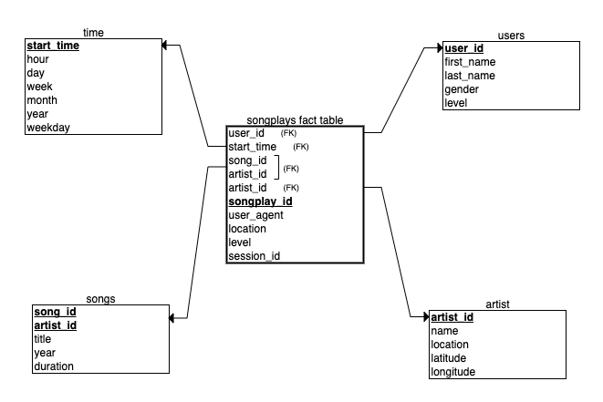
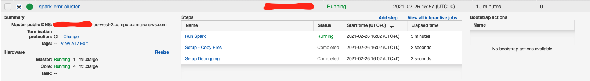

# Project: Data Modeling with Apache Spark

_This repository contains the results of the "Data Modelling with Apache Spark" Project which is part of the Udacity Data Engineering Nanodegree._

## Introduction
A music streaming startup, *Sparkify*, has grown their user base and song database and want to move their processes and data onto the cloud. Their data resides in S3, in a directory of JSON logs on user activity on the app, as well as a directory with JSON metadata on the songs in their app.

As their data engineer, I  tasked with building an ETL pipeline that extracts their data from S3, processes them using Spark, and loads the data back into S3 as a set of dimensional tables. This will allow their analytics team to continue finding insights in what songs their users are listening to.

## Project Description
In this project, I applied what I've learned on Spark and data lakes to build an ETL pipeline for a data lake hosted on S3. To complete the project, I loaded the data from S3, process the data into analytics tables using Spark, and load them back into S3. I'll deploy this Spark process on a cluster using AWS.

## Data
I worked with two datasets that reside in S3. Here are the S3 links for each:

* Song data: ```s3://udacity-dend/song_data```
* Log data: ```s3://udacity-dend/log_data```

The data sources (available in S3), shared by Sparkify, are the following:

### Song Dataset
The first dataset is a subset of real data from the Million Song Dataset. Each file is in JSON format and contains metadata about a song and the artist of that song. The files are partitioned by the first three letters of each song's track ID. For example, here are filepaths to two files in this dataset.

```
song_data/A/B/C/TRABCEI128F424C983.json
song_data/A/A/B/TRAABJL12903CDCF1A.json
```

And below is an example of what a single song file, TRAABJL12903CDCF1A.json, looks like.

```json
{ "num_songs": 1, "artist_id": "ARJIE2Y1187B994AB7", "artist_latitude": null, "artist_longitude": null, "artist_location": "", "artist_name": "Line Renaud", "song_id": "SOUPIRU12A6D4FA1E1", "title": "Der Kleine Dompfaff", "duration": 152.92036, "year": 0 }
```

### Log Dataset
The second dataset consists of log files in JSON format generated by this [event simulator](https://github.com/Interana/eventsim) based on the songs in the dataset above. These simulate activity logs from a music streaming app based on specified configurations.

The log files in the dataset are partitioned by year and month. For example, here are filepaths to two files in this dataset.

```
log_data/2018/11/2018-11-12-events.json
log_data/2018/11/2018-11-13-events.json
```

And below is an example of what the data in a log file, 2018-11-12-events.json, looks like.


<br/>

## Schema for Song Play Analysis
Using the song and log datasets, I created a **star schema** data warehouse optimized for queries on song play analysis. It has one **Fact** table having business data, and supporting **Dimension** tables. Database schema is the following:

* Sparkify analytics database named `sparkifydb`



<br/>

This model, includes the following tables:

### Fact Table
`songplays` - ecords in event data associated with song plays i.e. records with page `NextSong`.  
    
    songplay_id, start_time, user_id, level, song_id, artist_id, session_id, location, user_agent

<br/>

### Dimension Tables
`users` - users in the app.
    
    user_id, first_name, last_name, gender, level

`songs` - songs in music database.

    song_id, title, artist_id, year, duration

`artists` - artists in music database.
    
    artist_id, name, location, latitude, longitude

`time` - timestamps of records in **songplays** broken down into specific units.

    start_time, hour, day, week, month, year, weekday


<br/>

Principal advantages of using this Star Schema:

* Denormalized tables
* Easy for Sparkify users to understand
* Query performance
* Fast aggregation

The above schema allows in a very quick and easy way to obtain aggregations to answer different questions such as: what songs users are listening to? what songs are most heard? what is the duration? which users listen to these songs? which are the artists? etc...).

<br/>

## ETL Process
### ETL Description

The Spark ETL job processes the `song files` then the `log files`:

1. The song files are listed and iterated over relevant information in the artists and the song folders in parquet. 

2. The log files are filtered by the `NextSong` action.

3. The subsequent dataset is then processed to extract the `date, time, year` etc. 

4. All fields and records are then appropriately entered into the `time`, `users` and `songplays` folders in parquet for analysis.

<br/>

### ETL Pipeline

1. Create data structure if it doesn't exist on the S3.
1. Create EMR Cluster and deploy ETL Process;
1. Create a Spark Session using the Apache Hadoop AWS module;
1. Ingest Log and Song data files from desired location;
1. Clean and process data (add unique identifier, remove duplicates, remove nulls values, create folders and parquet files);
1. Copy final tables to S3 folders;
1. Delete EMR Cluster, S3 and other resources.

<br/>

## Project repository structure
The following folders and files are contained in the project repository:

```
. apache-spark-data-lake
|
│   README.md                                # Project description and documentation
│   .gitignore                               # Files and extension ignored in commited
│   requirements.txt                         # Python requirements and libraries
└───data                                     # Locally data source (files) and generated new files 
└───resources                                # Project resources (images, others...)
│     └─── images                            # Images about process
└───notebooks                                # Jupyter notebooks
│     └─── analysis_aws_data_lake.ipynb      # Jupyter notebook for analysis data
└───src                                      # Source code
│       │__ config.py                        # Python code to update config file
│       │__ create_deploy_emr_cluster.py     # Python code to create and deploy AWS EMR cluster
│       │__ dl.cfg                           # Configuration file, credentials for AWS account
│       │__ etl.py                           # Python code to ETL pipeline
│       └── database.py                      # Python code to create AWS cluster
└──
```

<br/>

The main files:
* `database.py` this module provides all methods to interact with AWS Account and Spark. It contains the cluster and session creation methods, IAM Roles, EMR and others.

* `config.py` this module provides all methods to interact with AWS. It contains the cluster and session deletion methods, IAM Roles, VPC, EC2, Redshift and others.

* `create_deploy_emr_cluster.py` this module allows to create the erm cluster and implements the deployment process in the cluster.

* `etl.py` this module reads and processes files from events and songs data and loads them into our AWS cluster.


<br/>


## Requirements

The following tools and packages are necessary to run the scripts locally:

* Git
* Python3
    * boto3
    * pandas
    * pyspark   
* Requirements *
* AWS Account
* AWS SDK for Python

<br/>

## How to use the Repository (for running locally in your machine)

<br/>

**Clone repository**

``` bash
git clone https://github.com/dacosta-github/udacity-de.git 
```

<br/>

**Change directory to local repository**

```bash
cd apache-spark-data-lake
```

<br/>

**Create and active python virtual environment**

_Run these following commands in new terminal window or tab_
```bash
python3 -m venv python-venv            
source python-venv/bin/activate 
```

<br/>
   
**Install requirements**

```bash
python3 -m pip install --upgrade pip
pip install -r requirements.txt  
```

<br/>

**Create a AWS EMR Cluster scripts**

This step is very important, here I used AWS SDK for Python to interact with my AWS Account. To do this, it's first necessary to edit the configuration file with your admin credentials from the AWS account.

Note, if you don't have a user created as **admin**, please create a user so that you can perform the following processes. You can see how to create it [here](https://classroom.udacity.com/nanodegrees/nd027-ent/parts/c05b833c-a2b7-43a5-b2a9-6dcc7b0fe0d1/modules/e8a78a0c-5bb6-40e0-9904-57030d78ce46/lessons/53e6c5d3-c9bb-4938-9133-bf8c6bfad3da/concepts/ef0f5bdf-d5e2-461c-b375-fc0dd89ccb79):
1. Create IAM user (e.g. `aws_admin`)
2. Create a default Job Flow Role (`EMR_EC2_DefaultRole`)

<br/>

**Edit `dl.cfg` file**

To run the process you must first edit the `apache-spark-data-lake/src/dl.cfg` file with your settings. This file contains the configuration variables used in the scripts to create and configure AWS resources.

Below are the variables that the user needs to configure before running the scripts.

* **NAME** = `<ENTER AWS USER ADMIN NAME>`  # paste your User Name
* **AWS_ACCESS_KEY_ID** = `<ENTER AWS ACCESS KEY>`   # paste your user Access Key Id
* **AWS_SECRET_ACCESS_KEY** = `<ENTER AWS SECRET KEY>`  # paste your user Secret Access Key
* **REGION_NAME** = `<ENTER AWS REGION NAME>`  # paste your user Region Name


`Never save and commited in your Github your AWS ACCESS KEY ID & AWS SECRET KEY on scripts!`


<br/>

**Run the create aws EMR cluster scripts**
```bash
cd src
python3 -m create_deploy_emr_cluster   # create a aws emr cluster, roles, ...
```

_Log obtained after execution:_
```
(python-venv) user@BGSN0003 src % python3 -m create_deploy_emr_cluster
Step 1 - Creating IAM Client 2021-02-26 15:15:11.051642
IAM Role already exists: arn:aws:iam::113261559758:role/MyEmrRole
Step 1 - IAM Client Created 2021-02-26 15:15:12.182924
Step 2 - Creating S3 Client 2021-02-26 15:15:12.182958
Step 2 - S3 Client Created 2021-02-26 15:15:12.193243
Step 3 - Creating S3 Buckets 2021-02-26 15:15:12.193288
S3 Bucket already exists:  udacity-spark-data-lake {'LocationConstraint': 'us-west-2'}
S3 Bucket already exists:  udacity-spark-etl {'LocationConstraint': 'us-west-2'}
Step 3 - Output S3 Buckets Created 2021-02-26 15:15:15.592365
Step 4 - Updating Config File 2021-02-26 15:15:15.592402
Step 4 - Config File Updated2021-02-26 15:15:15.593833
Step 5 - Setting Up S3 Buckets 2021-02-26 15:15:15.593875
Step 5.1 - Input Data: s3a://udacity-dend/
Step 5.1 - Output Data: s3a://udacity-spark-data-lake
Step 5 - Set Up S3 Buckets Completed 2021-02-26 15:15:15.593956
Step 6 - Uploading Code from Local to Cluster: 2021-02-26 15:15:15.593969
Code uploaded in S3 bucket with success: etl.py udacity-spark-etl
Step 6 - Code Uploaded 2021-02-26 15:15:16.490117
Step 7 - Creating EMR Cluster: 2021-02-26 15:15:16.490154
EMR cluster created with the JobFlowId: j-173G49XNF2H4A
Step 7 - EMR Cluster Created with Success: 2021-02-26 15:15:17.851481
Note: Go to the AWS console - EMR service and check the cluster and job status.
```

Confirm that the `dl.cfg` file has been successfully updated.

**Go to the AWS console - EMR service and check the cluster and job status. Once the process is complete, you can validate the results.**

<br/>

**Check results**

_This command launches the **Jupyter Notebook** application and opens an installation in the browser automatically. Afterwards, you should navigate to the notebook folder and open the `analysis_aws_data_lake.ipynb`. notebook later is able to run the code._

```bash
cd ..
cd notebooks
jupyter notebook     # http://127.0.0.1:8888/?token=XXXXXXXXXXXXXXX
```
<br/>

**Exploring the Jupyter Notebooks**
_You should open the following link in your web browser:_

```bash
http://localhost:5555/browser/     # Credentials in configuration file dwh.cg
```

After all validations you can delete the created environments (python). To do this, use the following commands:

On the same terminal as the python env, execute:

```bash
ctrl+c # to close Jupyter Notebook instance, use Ctrl+C in the terminal
```


<br/>

**Exploring the AWS EMR Cluster and Results**

I used the **AWS Console - ERM Cluster Service** tool also to access the data cluster created.




<br/>

**Deleting a AWS EMR Cluster and S3 Buckets**

```Go to the AWS Console, EMR Cluster service terminate the EMR Cluster that is active.```


```Go to the AWS Console, S3 service and clean & delete the S3 buckets created.```

<br/>

**Cleaning virtual environment**

```bash
cd ..
cd aws-data-warehouse-modeling
deactivate
rm -r python-venv
```

<br/>

## Acknowledgements

* Million Song [Dataset](http://millionsongdataset.com).

* How to create EMR cluster using python boto3 [creating a EMR cluster](https://www.edureka.co/community/39304/how-to-create-emr-cluster-using-python-boto3).

* The python boto3 [boto3](https://boto3.amazonaws.com/v1/documentation/api/latest/reference/services/emr.html#EMR.Client.add_job_flow_steps).

* How to create EMR cluster with Apache Spark and Apache Zeppelin [boto3](https://nikkisharma536.medium.com/how-to-create-emr-cluster-with-apache-spark-and-apache-zeppelin-c7cf5029f783).

* [Create AWS Redshift cluster using AWS python SDK](https://shravan-kuchkula.github.io/create-aws-redshift-cluster/).

* [Udacity rubric](https://review.udacity.com/#!/rubrics/2502/view).

* [Creating a Redshift Cluster Using AWS Python SDK](https://medium.com/nerd-for-tech/creating-a-redshift-cluster-using-with-aws-python-sdk-9ba51416473).

* [Python Code Samples for Amazon Redshift](https://docs.aws.amazon.com/code-samples/latest/catalog/code-catalog-python-example_code-redshift.html).

<br/>