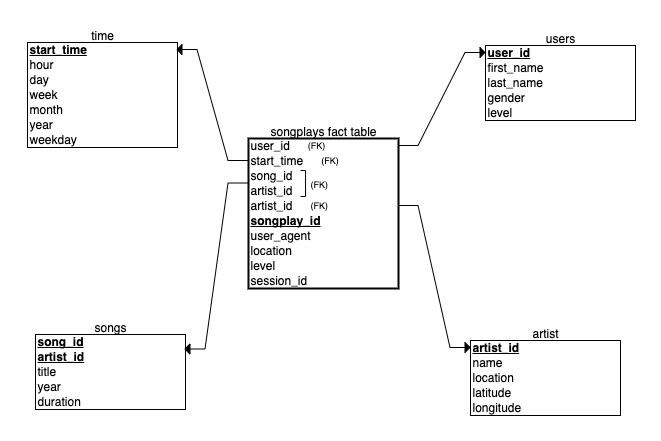
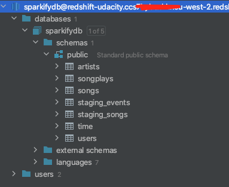
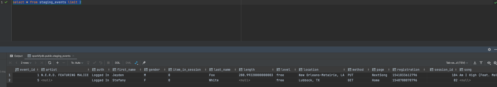
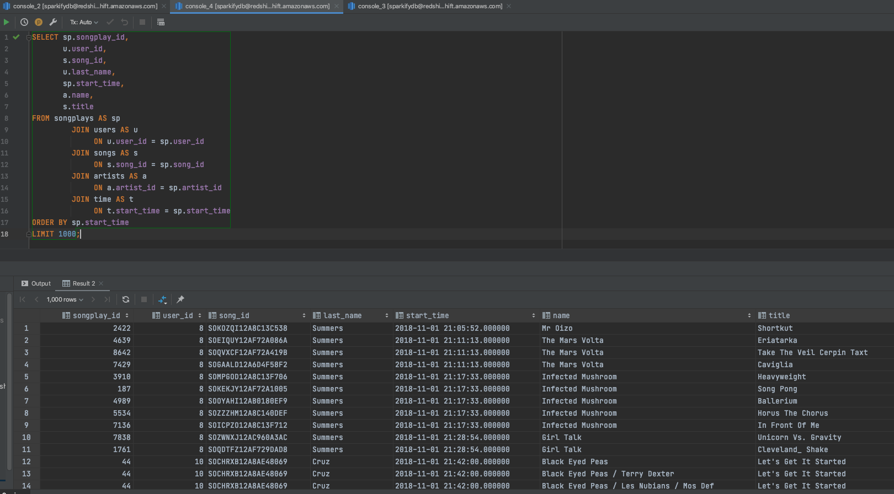

# Project: Data Modeling with AWS Redshift

_This repository contains the results of the "Data Modelling with AWS Redshift" Project which is part of the Udacity Data Engineering Nanodegree._

## Introduction
A music streaming startup, *Sparkify*, has grown their user base and song database and want to move their processes and data onto the cloud. Their data resides in S3, in a directory of JSON logs on user activity on the app, as well as a directory with JSON metadata on the songs in their app.

As their data engineer, I tasked with building an ETL pipeline that extracts their data from S3, stages them in Redshift, and transforms data into a set of dimensional tables for analytics team to continue finding insights in what songs their users are listening to.

## Project Description
In this project, I applied what I've learned on data warehouses and AWS to build an ETL pipeline for a database hosted on Redshift. To complete the project, I need to load data from S3 to staging tables on Redshift and execute SQL statements that create the analytics tables from these staging tables.

## Data
I worked with two datasets that reside in S3. Here are the S3 links for each:

* Song data: ```s3://udacity-dend/song_data```
* Log data: ```s3://udacity-dend/log_data```
* Log data json path: ```s3://udacity-dend/log_json_path.json```

The data sources (available in S3), shared by Sparkify, are the following:

### Song Dataset
The first dataset is a subset of real data from the Million Song Dataset. Each file is in JSON format and contains metadata about a song and the artist of that song. The files are partitioned by the first three letters of each song's track ID. For example, here are filepaths to two files in this dataset.

```
song_data/A/B/C/TRABCEI128F424C983.json
song_data/A/A/B/TRAABJL12903CDCF1A.json
```

And below is an example of what a single song file, TRAABJL12903CDCF1A.json, looks like.

```json
{ "num_songs": 1, "artist_id": "ARJIE2Y1187B994AB7", "artist_latitude": null, "artist_longitude": null, "artist_location": "", "artist_name": "Line Renaud", "song_id": "SOUPIRU12A6D4FA1E1", "title": "Der Kleine Dompfaff", "duration": 152.92036, "year": 0 }
```

### Log Dataset
The second dataset consists of log files in JSON format generated by this [event simulator](https://github.com/Interana/eventsim) based on the songs in the dataset above. These simulate activity logs from a music streaming app based on specified configurations.

The log files in the dataset are partitioned by year and month. For example, here are filepaths to two files in this dataset.

```
log_data/2018/11/2018-11-12-events.json
log_data/2018/11/2018-11-13-events.json
```

And below is an example of what the data in a log file, 2018-11-12-events.json, looks like.


<br/>

## Schema for Song Play Analysis
Using the song and log datasets, I created a **star schema** data warehouse optimized for queries on song play analysis. It has one **Fact** table having business data, and supporting **Dimension** tables. Database schema is the following:

* Sparkify analytics database named `sparkifydb`



<br/>

This model, includes the following tables:

### Fact Table
`songplays` - ecords in event data associated with song plays i.e. records with page `NextSong`.  
    
    songplay_id, start_time, user_id, level, song_id, artist_id, session_id, location, user_agent

<br/>

### Dimension Tables
`users` - users in the app.
    
    user_id, first_name, last_name, gender, level

`songs` - songs in music database.

    song_id, title, artist_id, year, duration

`artists` - artists in music database.
    
    artist_id, name, location, latitude, longitude

`time` - timestamps of records in **songplays** broken down into specific units.

    start_time, hour, day, week, month, year, weekday


<br/>

Principal advantages of using this Star Schema:

* Denormalized tables
* Easy for Sparkify users to understand
* Query performance
* Fast aggregation

The above schema allows in a very quick and easy way to obtain aggregations to answer different questions such as: what songs users are listening to? what songs are most heard? what is the duration? which users listen to these songs? which are the artists? etc...).

<br/>

## ETL Process

### ETL Description

The ETL process is composed of three phases:

`1. Staging phase` - here the data are stored in staging tables, before being loaded into the final model. This phase allows the several files to be uploaded into an structure so that they can be worked on in the future.

Have two staging tables which copy the JSON file inside the AWS S3 buckets:

* `staging_events` - event data about what users have done.
    
        event_id, artist, auth, first_name, gender, item_in_session, last_name, length,level, location method, page, registration, session_id, song, status, ts, user_agent, user_id

* `staging_songs` - song data about songs and artists.

        artist_id, artist_latitude, artist_longitude, artist_location , artist_name, song_id, title, year, num_songs, duration        

`2. Dimension phase` of transformation and loading of dimension tables. 

`3. Fact phase` the data are worked on and loaded into this structure, so that they can be analysed from different perspectives (dimension).

<br/>

### ETL Pipeline

1. create AWS Redshift cluster
2. create data structure if it doesn't exist on the AWS Redshift cluster
3. load data from S3 to staging tables on AWS Redshift
4. load data from staging tables to analytics tables on AWS Redshift
5. running the analytic queries on AWS Redshift database to compare results
1. delete your AWS Redshift cluster when finished

<br/>

## Project repository structure
The following folders and files are contained in the project repository:

```
. aws-data-warehouse-modeling
|
│   README.md                          # Project description and documentation
│   .gitignore                         # Files and extension ignored in commited
│   docker-compose.yml                 # Container for several tools
│   requirements.txt                   # Python requirements and libraries
└───data                               # Locally data source (files) and generated new files 
└───resources                          # Project resources (images, others...)
│     └─── images                      # Images about process
└───src                                # Source code
│   └─── notebooks                     # Jupyter notebooks
│   └─── analysis_aws_data.ipynb       # Jupyter notebook for analysis data
│   └─── scripts                       # Python code
│       │__ create_aws_cluster.py      # Python code to create AWS cluster
│       │__ create_tables.py           # Python code to create database
│       │__ delete_aws_cluster.py      # Python code to delete AWS cluster
│       │__ dwh.cfg                    # Configuration file, credentials for AWS account
│       │__ etl.py                     # Python code to ETL pipeline
│       └── sql_queries.py             # Python code to SQL Statments
└──.
```

<br/>

The main files:
* `create_aws_cluster` this module provides all methods to interact with AWS Account. It contains the cluster and session creation methods, IAM Roles, VPC, EC2, Redshift and others.

* `delete_aws_cluster` this module provides all methods to interact with AWS. It contains the cluster and session deletion methods, IAM Roles, VPC, EC2, Redshift and others.

* `create_table.py` this module provides all methods to interact with AWS Redshift cluster server. It contains the creation tables and data loading fact and dimension tables for the star schema in AWS Redshift.

* `etl.py` this module reads and processes files from events data and loads them into final tables in our AWS redshift cluster and database (load data from S3 into staging tables on AWS Redshift and then process that data into your analytics tables on AWS Redshift). This file should always be executed before running the DDL scripts and the database should be cleaned.

* `sql_queries.py` this module contains all sql queries/statements, and it's used (imported) in other files or scripts.

<br/>


## Requirements

The following tools and packages are necessary to run the scripts locally:

* Git
* Python3
    * boto3
    * pandas    
* Requirements *
* AWS Account
* AWS SDK for Python
* Docker
* Docker-Compose
    * _Postgres_

<br/>

## How to use the Repository (for running locally in your machine)

<br/>

**Clone repository**

``` bash
git clone https://github.com/dacosta-github/udacity-de.git 
```

<br/>

**Change directory to local repository**

```bash
cd aws-data-warehouse-modeling
```

<br/>

**Start postgres docker container**

_Run this command in new terminal window or tab_

```bash
docker-compose up
```

_check containers_
```bash
docker ps # run in new terminal
```

<br/>

**Create and active python virtual environment**

_Run these following commands in new terminal window or tab_
```bash
python3 -m venv python-venv            
source python-venv/bin/activate 
```

<br/>
   
**Install requirements**

```bash
python3 -m pip install --upgrade pip
pip install -r requirements.txt  
```

<br/>

**Create a AWS Redshift Cluster scripts**

This step is very important, here I used AWS SDK for Python to interact with my AWS Account. To do this, it's first necessary to edit the configuration file with your admin credentials from the AWS account.

Note, if you don't have a user created as **admin**, please create a user so that you can perform the following processes. You can see how to create it [here](https://classroom.udacity.com/nanodegrees/nd027-ent/parts/c05b833c-a2b7-43a5-b2a9-6dcc7b0fe0d1/modules/e8a78a0c-5bb6-40e0-9904-57030d78ce46/lessons/53e6c5d3-c9bb-4938-9133-bf8c6bfad3da/concepts/ef0f5bdf-d5e2-461c-b375-fc0dd89ccb79):
1. Create IAM user (e.g. `dwhuser`)
2. Create IAM role (e.g. `dwhRole`) with `AmazonS3ReadOnlyAccess` access rights
get ARN

<br/>

**Edit `dwh.cfg` file**

To run the process you must first edit the `dwh.cfg` file with your settings

This file contains the configuration variables used in the scripts to create and configure AWS resources.

Below are the variables that the user needs to configure before running the scripts.

* **NAME** = `<ENTER AWS USER ADMIN NAME>`  # paste your User Name
* **AWS_ACCESS_KEY_ID** = `<ENTER AWS ACCESS KEY>`   # paste your user Access Key Id
* **AWS_SECRET_ACCESS_KEY** = `<ENTER AWS SECRET KEY>`  # paste your user Secret Access Key
* **REGION_NAME** = `<ENTER AWS REGION NAME>`  # paste your user Region Name
* **VPC_ID** = `<ENTER VPC ID>`  # paste the VPC_ID (If blank the first VPC on user's AWS account is considered)

`Never save and commited in your Github your AWS ACCESS KEY ID & AWS SECRET KEY on scripts!`


<br/>

**Run the create aws cluster scripts**
```bash
cd src
cd scripts
python3 -m create_aws_cluster   # create a aws redshift cluster, roles, ...
```

_Log obtained after execution:_
```
(python-venv) user@BGSN0003 scripts % python3 -m create_aws_cluster
IAM Role Created: my_redshift_role.
Security Group Created sg-49584345730453 in vpc vpc-53532344.
Creating cluster: redshift-udacity
Cluster status: creating
Database name: sparkifydb
Waiting for cluster to be created...
Cluster created.
Endpoint=redshift-udacity.popsdcweie.eu-west-2.redshift.amazonaws.com
Updatting CFG file...
CFG file Updated.
```

Confirm that the dwh.cfg file has been successfully updated.

<br/>

**Run the DDL and ETL scripts**

```bash
python3 -m create_tables # create database schema DDL
python3 -m etl.          # load one file per commit ETL
```

_Log obtained after execution:_
```bash
(python-venv) user@BGSN0003 scripts % python3 -m create_tables
The cluster connection has been successfully established!
Dropping tables...
Creating tables...
The database schema was created with success.

(python-venv) user@BGSN0003 scripts % python3 -m etl
1. Executing ETL pipeline...
2. Cleaning all final tables...
3. Loading staging tables...
4. Loading final tables...
5. ETL pipeline completed!


```
<br/>


**Check results**

_This command launches the **Jupyter Notebook** application and opens an installation in the browser automatically. Afterwards, you should navigate to the notebook folder and open the `analysis_aws_data.ipynb`. notebook later is able to run the code._

```bash
cd src
cd notebooks
jupyter notebook     # http://127.0.0.1:8888/?token=XXXXXXXXXXXXXXX
```
<br/>

**Exploring the Jupyter Notebooks**
_You should open the following link in your web browser:_

```bash
http://localhost:5555/browser/     # Credentials in configuration file dwh.cg
```

After all validations you can delete the created environments (python and docker). To do this, use the following commands:

On the same terminal as the python env, execute:

```bash
ctrl+c # to close Jupyter Notebook instance, use Ctrl+C in the terminal
```


<br/>

**Exploring the AWS Redshift Database**

I used the **Datagrip** tool also to access the data avaiable in my AWS Redshift Cluster created.





**Results**

Queries to analyse the results:

1. Get users and songs `they listened at particular time`

```SQL
    SELECT  sp.songplay_id,
        u.user_id,
        s.song_id,
        u.last_name,
        sp.start_time,
        a.name,
        s.title
    FROM songplays AS sp
        JOIN users   AS u 
            ON u.user_id = sp.user_id
        JOIN songs   AS s 
            ON s.song_id = sp.song_id
        JOIN artists AS a 
            ON a.artist_id = sp.artist_id
        JOIN time    AS t 
            ON t.start_time = sp.start_time
    ORDER BY sp.start_time ASC
    LIMIT 1000;
```

<br/>



2. Get users `who listen to more songs`

```SQL
    SELECT (u.first_name + ' ' + u.last_name) as user, 
            COUNT(s.title) as listened
    FROM songplays as sp
    JOIN songs as s 
        ON sp.song_id = s.song_id
    JOIN artists as a 
        ON sp.artist_id = a.artist_id
    JOIN users as u 
        ON sp.user_id = u.user_id
    GROUP BY u.first_name, u.last_name
    ORDER BY 3 DESC
```

3. Get users who heard the artist `Depeche Mode`
```SQL
    SELECT (u.first_name + ' ' + u.last_name) as user,
           s.title                            as song,
           a.name                             as artist,
           t.day,
           t.month
    FROM songplays as sp
             JOIN songs as s
                  ON sp.song_id = s.song_id
             JOIN artists as a
                  ON sp.artist_id = a.artist_id
             JOIN users as u
                  ON sp.user_id = u.user_id
             JOIN time as t
                  ON sp.start_time = t.start_time
    WHERE t.year = 2018
      AND a.name = 'Depeche Mode'
```

<br/>

**Deleting a AWS Redshift Cluster scripts**

```bash
cd src
cd scripts
python3 -m delete_aws_cluster  # create a cluster, roles, ...
```
_Log obtained after execution:_
```
(python-venv) user@BGSN0003 scripts % python3 -m delete_aws_cluster
Deleting Redshift cluster: redshift-udacity
Redshift Cluster status: deleting
Waiting for Redshift cluster to be deleted...
Redshift Cluster deleted.
IAM Role 'my_redshift_role' does not exist!
Security Group deleted. 
```

**Cleaning virtual environment**

```bash
cd ..
cd aws-data-warehouse-modeling
deactivate
rm -r python-venv
```

If you have chosen to create the docker compose, on the same terminal as the docker, execute:

```bash
ctrl+c  # to close Docker Containers, use Ctrl+C in the terminal
```

```bash
docker ps
docker kill
docker system prune -a  # select y
```

```bash
docker volume ls
docker volume rm postgres-data-modeling_postgres-data # postgres-data
```

```bash
docker network ls
docker network rm postgres-compose-network # postgres-compose-network
docker network prune  # select y
```

<br/>

## Acknowledgements

* [Create AWS Redshift cluster using AWS python SDK](https://shravan-kuchkula.github.io/create-aws-redshift-cluster/).

* [Udacity rubric](https://review.udacity.com/#!/rubrics/2501/view).

* [Data Warehouse with Redshift](https://github.com/drobim-data-engineering/Data-Warehouse-with-Redshift)

* [Creating a Redshift Cluster Using AWS Python SDK](https://medium.com/nerd-for-tech/creating-a-redshift-cluster-using-with-aws-python-sdk-9ba51416473).

* [Python Code Samples for Amazon Redshift](https://docs.aws.amazon.com/code-samples/latest/catalog/code-catalog-python-example_code-redshift.html).

* [AWS Redshift Connector](https://github.com/aws/amazon-redshift-python-driver).

* Songs data set on [million song dataset](http://millionsongdataset.com).

<br/>

