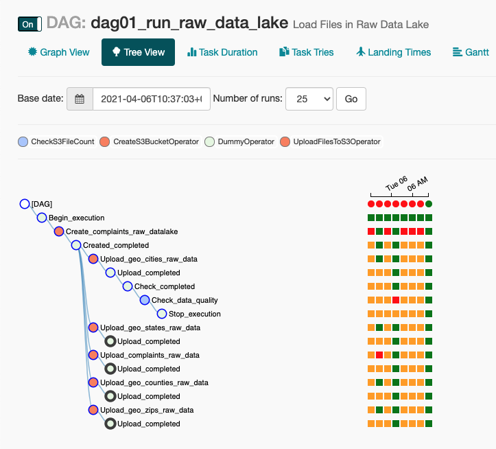
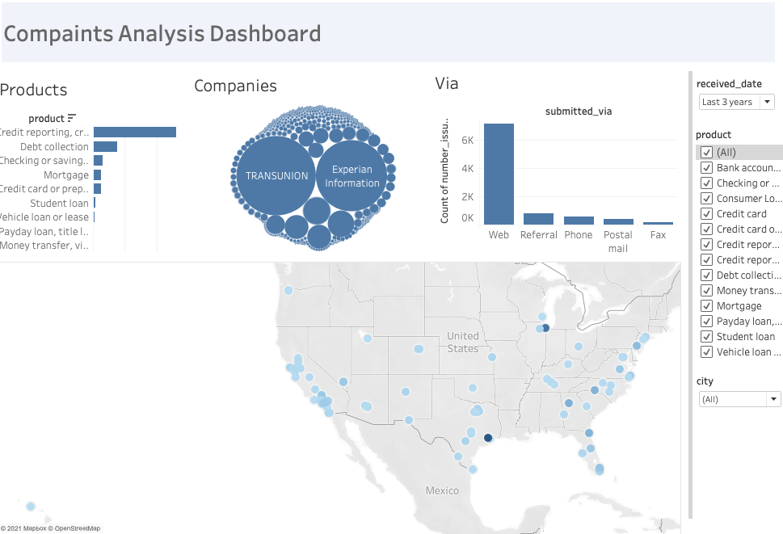

# Capstone project
# Data Platform for Analytics & Machine Learning - Financial companies complaints analysis

_This repository contains the results of the "Capstone Project" project which is last project of the Udacity Data Engineering Nanodegree._

<br/>

## 1. Introduction
This data engineering capstone project was an excellent opportunity to combine all the concepts and technologies I have learned throughout the programme and will certainly be an important part of my portfolio.

In this project, I have chosen to define the scope of the project and the data that will be used. I tried to establish a broader scope both in terms of concepts and technology which also allowed me to develop new skills in several technologies.

The Bureau of Consumer Financial Protection has grown its financial complaints database exponentially in recent years and wants to move its processes and data to the cloud. Its data resides stored online, in several formats, in a directory of CSV and JSON records.
The Bureau also decided it was time to introduce more automation and monitoring into their data warehouse ETL pipelines and came to the conclusion that the best tool to achieve this is Apache Airflow.

So they decided to bring me into the project and they expect me to create high quality data pipelines that are dynamic and built from reusable tasks, can be monitored, and allow easy backfills. 

They also noted that data quality plays a big role when analytics are run on top of the data warehouse and they want to run tests against their datasets after the ETL steps have been performed to catch any discrepancies in the datasets.

Source data resides online and needs to be processed in the Bureau data warehouse in your AWS account (S3 and Amazon Redshift). Source datasets consist of CSV and JSON records that classify an incoming complaint.

As their data engineer, I was in charge of understanding the data that is available and the issues that could arise, build a model for a Data Lake (DL) and for a Data warehouse (DW), I was also in charge of building ETL pipelines that extract the data and load it into the Data Lake in S3, and then staging it in Redshift, and transform the data into a set of dimensional tables for the analysis team to continue studying all the complaints.

In parallel, it was also suggested to create mechanisms to explore analytical data in a more dynamic way, such as the use of a dashboard tool, in this case Tableau.

Last but not least, the company wants to enter the world of Machine Learning, with very optimistic perspectives. Using these technologies, the company wants to understand if it can automatically calssify the issues/complaints that are received daily for specific products, contributing in a positive way to the costumer support teams.

<br/>

## 2. Project Description

In this project, I applied what I learned in data warehouses and AWS to build an ETL pipeline for a database hosted in S3 and Redshift. To complete this project, I initially need to define the technical architecture of the project, know the data that is available, design the data model for the Data Lake and the Data Warehouse. 

Subsequently, I need to explore the raw data, create the processes to convert the data into several smaller files so that I can load them into the Data Lake in S3. Subsequently, I need to Copy the data that is in the raw Data Lake into staging tables in Redshift. When the data is available in the Data Warehouse , it will be possible to proceed with the creation of the Dashboard and the exploration of the data using jupyter notebooks.

Finally, also using the jupyter notebook and some Python Machine Learning, and data presentation libraries, I will be able to produce a small Web App to meet the need for text classification.

<br/>

## 3. Data
### 3.1. Describe and Gather Data
In this project, based on the main objective of the "company", and the available data, **five** data sources will be used:

_For this project I will use a dataset called **Consumer Complaint Database** (Consumer Finance Complaints (Bureau of Consumer Financial Protection)) which can be downloaded from Kaggle [1] or Data.gov [2]. “These are real world complaints received about financial products and services. Each complaint has been labeled with a specific product; therefore, this is a supervised text classification problem. With the aim to classify future complaints based on its content, we used different ML algorithms can make more accurate predictions (i.e., classify the complaint in one of the product categories). The dataset contains different information of complaints that customers have made about a multiple products and services in the financial sector, such us Credit Reports, Student Loans, Money Transfer, etc. The date of each complaint ranges from November 2011 to May 2019” [1]._        

* **Consumer Finance Complaints** - (202.144.0 records and 18 columns, 320.1 MB, CSV.ZIP). 

* **US Cities** - (199 records, 33 KB, JSON) - - This dataset contains the list of cities codes in the USA.

* **US Counties** - (200 records, 22 KB, JSON) - This dataset contains the list of counties codes in the USA.

* **US Zip** - (501 records, 47 KB, JSON)- This dataset contains the list of zip codes in the USA.

* **US States** - (51 records, 4 KB, JSON) - This dataset contains the list of states codes in the USA.

These last 4 data files will allow us to create a geographic database for the complaints that are received. In the complaint database only the Zip code is stored.

Example of the first two lines of the `complaints` data source:


<br/>

Example of the first line of the `cities.json` data source:
```json
{
    "rank": 1,
    "name": "New York City",
    "usps": "NY",
    "pop2021": 8230290,
    "pop2010": 8190210,
    "density": "10579.0101",
    "aland": 777983000
  }

```

More about data sources:
* [Data Dictionary - README](https://github.com/dacosta-github/udacity-de/tree/main/capstone-project/data/README.md)

* [Metadata](https://github.com/dacosta-github/udacity-de/tree/main/capstone-project/data/dictionary/metatada.json)

<br/>

### 3.2. Explore Data

At this stage, and after understanding what the organizational needs are in terms of storage, processing and analytical mechanisms, an understanding of the data that the company provides was carried out.

As I mentioned previously, the data was provided in raw form in 3 different formats: CSV, ZIP and JSON.

We explored the data using exploratory data analysis (EDA) techniques, using Jupyter Notebook, Python + Pandas and Python + Spark.

As I explain in more detail below, the data analysis can be analysed in the following notebooks:

* `collection/01_data_collection.ipynb` - Notebook that allows access to the data that will be stored in the Data Lake

* `collection/02_data_exploration.ipynb` - Notebook that allows exploration of the data that has been stored in the data lake

* `dw_analysis/03_data_analysis_dw.ipynb` - Notebook that allows the exploration of the Data Warehouse in Redshift, of some metrics and that allows to understand how the data can be presented

* `spark/04_data_analysis_datalake_spark.ipynb` - Notebook that allows the exploration of the data that has been stored in the data lake, using the Spark technology

* `machine_learning/05_ml_train_evaluate_model.ipynb`  Notebook that allows you to access, explore, treat the source data that is stored in the data lake. It also allows ML models to be trained on the data in order to perform text classification tasks. Finally, it allows using the trained models to predict the classification of issue narratives.

<br/>

I have explored the data and will need to do some transformations:

- Cleaning up empty values;
- Data type conversion;
- Creation of Geographies;
- Splitting the files into several smaller files so they can be copied to the Data Lake.

Below, we can get some *Data Wrangling* techniques.

<br/>

### 3.3. Requirements Analysis and Data Insigths

At an analytic level I want to provide a very dynamic data access platform, that is, I want to present a platform that allows access to data in a fast way, in competition with hundreds of people, in almost real time. The idea is to give people the ability to access the data worked on in various formats, through technology.
The data will be available through the Data Lake and the Data Warehouse for ad-hoc search and analysis, and at the same time the analytical teams and the management of the company will have access to the data and kpi through the tableau server and the web app's.

In the end, both at the operational level and at a more strategic level, management teams, analytics, marketing, customer success, etc... will have access to data with a single click.

With the datasets I want to be able to provide the following information on financial complaints and be able to answer a set of questions:

* Origin of complaints
* Where do we have the most complaints? (State, City, Countie)
* Device used to report the complaints(Web, form, ...)
* Companies with most complaints?
* Which products comprise the most complaints?
* Which complaints have been responded to in time?
* How many complaints do we have total? Per day?Which companies got the most complaints?
* Are the responses timely?
* Do they get disputed? 
* Number of complaints by product
* Number of complaints by company (top 15 companies)
* Number of complaints by company response
* Mean number of complaints by day of month
* others ...

<br/>

## 3.4. Data Wrangling

As an example, by exploring the original datasets using the jupyter notebooks located in the `notebooks` folder, I could see that the data dispute process should include:

For the Consumer Finance Complaints:
- Converting the original file to UTF-8 before spliting 
- The narratives are free text and many records are blank
- There is no city and state information, but it can be obtained from the ZIP field when filled, so we collected other files
- Among other cases of information processing...

<br/>

## 4. Architecture and Technologies

This architecture was the one initially designed to meet the analytical needs of the organization. 
It is an architecture that includes some steps (marked with a star) that were not implemented because they are ideas for the scalability of the architecture. 

The architecture is adaptable to the needs of the analytical teams that can access data in different formats and over different technologies.  

The architecture below can be divided into 6 phases, one of which will be across the others.

<br/>


<br/>

The datasets will be cleaned, enriched to add more information and will be loaded into a data lake and data warehouse. Later the data will be used for analytics. To make this possible the following tools and technologies will be used:

**AWS S3**

The raw data will be stored on Amazon S3, which is an object storage service that offers industry-leading scalability, availability, and durability.

**AWS Redshift**

Considering the current data size, data from S3 will be injected into the Data Warehouse in AWS Redshift. It allows you to perform the ETL process, denormalizing datasets to create staging, fact and dimension tables.

**Apache Airflow**

The data pipelines will be built using Apache Airflow so that it is possible to orchestrate everything. Apache Airflow will provide an intuitive interface where we can track the progress and bottlenecks of our pipelines, which is a requirement of the organization.

**Python**

Python is a free, easy-to-use programming language that supports a wide variety of libraries to perform tasks such as pipeline creation, as well as data analysis, or machine learning algorithms. We use this technology transversally to the project, to create and develop programs that allow us to interact with data, process it and also visualise it.

**Apache Spark**

Apache Spark is a data processing framework that can quickly perform processing tasks on very large data sets, and can also distribute data processing tasks across multiple computers, on its own or in conjunction with other distributed computing tools.

**Juypter Notebooks**

Notebooks can be used for data cleaning and transformation, can be used to create data visualisation and can be used to create machine learning mechanisms. In this project, we use this technology to support all these possibilities.

**Tableau**

Tableau is the data visualisation and analysis tool, aiming to help people see and understand data. This tencology, in an abstract way, converts raw data into a very easy to understand format. Data analytics is great as it is a powerful visualisation tool in the business intelligence industry and allows for scalability. We use this technology to create pre-defined dashboards to meet your data visualization needs.

**AWS Sagemake**

Amazon SageMaker is a service that enables you to quickly and easily build, train, and deploy machine learning models at any scale. Amazon SageMaker includes modules that you can use together or independently to build, train, and deploy your machine learning models. In this project, although it is not used, we have defined this technology for scalability reasons of Machine Learning engines to support the business. 

**Streamlit**

Streamlit is a framwork that lets you turn data scripts into shareable web applications in minutes. It's all developed in Python, open source, and free! We use this technology to develop web applications to enable teams that can interact with the Machine Learning models created.

<br/>

## 5. Data Model
### 5.1. Star Schema

After exploring the data and considering the insights that the company want to have over the data, I came to the following data model:


<br/>

`Complaint DW` star schema consists of seven dimensions (Products, Tags, Issues, Complaints Info, Geographies, Dates and Companies) connected to fact table (Complaints). 


The tables mentioned are described below:

<br/>

**5.1.1. Dimension Tables**

The dimension tables allow to analyse the facts from different perspectives.

The dimension tables are as follows:

* `dim_companies` - this table allows to assess the facts from the perspective of the companies making complaints.

| Field | Description | Data Type | Key | Is Null | 
|-------|-------------|------|------|------|
| company_pk      |   Unique value and table identifier. It is primary key in the table and foreign key in the fact table. It is an incremental value for each new record that is inserted in the table.          | IGINT IDENTITY (0,1)     |  Yes    |   No   |
| name      | The complaint is about this company. For example, “ABC Bank.”             |  VARCHAR    |  No    |   No   |
| public_response      | The company’s optional, public-facing response to a consumer’s complaint. Companies can choose to select a response from a pre-set list of options that will be posted on the public database. For example, “Company believes complaint is the result of an isolated error.”            |  VARCHAR    |   No   |  No    |

<br/>

* `dim_issues` - this table allows to assess the facts from the perspective of the type of issues about the complaints.

| Field | Description | Data Type | Key | Is Null | 
|-------|-------------|------|------|------|
| issue_pk    |  Unique value and table identifier. It is primary key in the table and foreign key in the fact table. It is an incremental value for each new record that is inserted in the table.        |    BIGINT IDENTITY (0,1)     |  PRIMARY KEY     |   No   |
| issue    |    The issue the consumer identified in the complaint. For example, “Managing an account” or “Struggling to repay your loan.”         |    VARCHAR  |  No    |   No   |
| sub_issue   |    The sub-issue the consumer identified in the complaint. For example, “Deposits and withdrawals” or “Problem lowering your monthly payments.”         |   BIGINT   |  No    |   No   |

<br/>

* `dim_products` - this table allows to assess the facts from the perspective of the products about the complaints.

| Field | Description | Data Type | Key | Is Null | 
|-------|-------------|------|------|------|
| product_pk      |   Unique value and table identifier. It is primary key in the table and foreign key in the fact table. It is an incremental value for each new record that is inserted in the table.          |  BIGINT IDENTITY (0,1)    |   PRIMARY KEY    |    No  |
| product      | The type of product the consumer identified in the complaint. For example, “Checking or savings account” or “Student loan.”            | VARCHAR     |   No   |   No   |
| sub_product      | The type of sub-product the consumer identified in the complaint. For example, “Checking account” or “Private student loan.”            | VARCHAR     |   No   |    No  |

<br/>

* `dim_dates` - This table allows to assess the facts from the perspective of the time in which complaints are received or responses are sent.

| Field | Description | Data Type | Key | Is Null | 
|-------|-------------|------|------|------|
|  date     |    Calendar date         |  DATE    |  PRIMARY KEY     |   No   |
|  year     |    Year of Calendar date         |  INT    |   No   |   No   |
|  month     |  Month of Calendar date             |   INT   |   No   |    No  |
|  month_name    |    Month Name of Calendar date           |   varchar   |   No   |    No  |
|  day_of_month    |   Day of Calendar date            |   INT   |   No   |    No  |
|  day_of_week_num    |  Day of Week Calendar date             |  INT    |   No   |    No  |
|  day_of_week    |     Day of Week description Calendar date          |   varchar   |   No   |    No  |
|  week_of_year   |     Week of Year in Calendar date          |   INT   |   No   |    No  |
|  day_of_year     |     Day of Year in Calendar date          |   INT   |   No   |    No  |
|  is_weekend   |      Is if weekend       |   bool   |   No   |    No  |
|  quarter   |       Quarter of Calendar date        |   INT   |   No   |    No  |

<br/>

* `dim_geographies` - this table allows to assess the facts from a geographic perspective.

| Field | Description | Data Type | Key | Is Null  |
|-------|-------------|------|------|------|
|  geography_pk     |   Unique value and table identifier. It is primary key in the table and foreign key in the fact table. It is an incremental value for each new record that is inserted in the table.          |  BIGINT IDENTITY (0,1)    |  Yes    |   No   |
|  state     |    The state of the mailing address provided by the consumer.         |  VARCHAR    |   No   |   No   |
|  zip_code     | The mailing ZIP code provided by the consumer. This field may: i) include the first five digits of a ZIP code; ii) include the first three digits of a ZIP code (if the consumer consented to publication of their complaint narrative); or iii) be blank (if ZIP codes have been submitted with non-numeric values, if there are less than 20,000 people in a given ZIP code, or if the complaint has an address outside of the United States).            |   VARCHAR   |   No   |   No   |
|  county     | The county of the state address provided by the consumer.            |   VARCHAR   |   No   |   No   |
|  city     |  The city of the state address provided by the consumer.            |   VARCHAR   |   No   |   No   |
|  usps     |  Code of state address provided by the consumer.            |   VARCHAR   |   No   |   No   |

<br/>

* `dim_tags` - this table allows to assess the facts from the perspective of the tags about the complaints.

| Field | Description | Data Type | Key | Is Null  |
|-------|-------------|------|------|------|
| tag_pk      |   Unique value and table identifier. It is primary key in the table and foreign key in the fact table. It is an incremental value for each new record that is inserted in the table.          | BIGINT IDENTITY (0,1)    |  Yes   |    No  |
| tag_desc     |   Data that supports easier searching and sorting of complaints submitted by or on behalf of consumers.          |  VARCHAR    |   No   |    No  |

<br/>

* `dim_complaint`- this table allows to assess the facts from the perspective of the complaint information, the details of the complaints filed, such as the narratives that are important within this model.

| Field | Description | Data Type | Key | Is Null |
|-------|-------------|------|------|------|
| complaint_pk      |  Unique value and table identifier. It is primary key in the table and foreign key in the fact table. It is an incremental value for each new record that is inserted in the table.           |  BIGINT IDENTITY (0,1)    |       Yes   |    No  |
|  consumer_narrative     |  Consumer complaint narrative is the consumer-submitted description of “what happened” from the complaint.            | VARCHAR     |      No   |    No  |
|  consumer_consent_provider     |   Identifies whether the consumer opted in to publish their complaint narrative. We do not publish the narrative unless the consumer consents, and consumers can opt-out at any time.          |   VARCHAR   |       No   |    No  |
|  submitted_via     |   How the complaint was submitted to the CFPB. For example, “Web” or “Phone.”          |  VARCHAR    |       No   |    No  |

<br/>

In the **Complaint DW Star Schema** above you can also see the data type of each of the attributes.

<br/>

**5.1.2. Fact Table**

The fact table allows to assess all the financial complaints received. 
Two metrics were initially defined (`number_issues` and `is_timely_response`) that will allow the analysis of the KPIs previously established.

The fact table is as follow:

* `fact_complaints` - this fact table allows to measure the number of issues and the responses to all the complaints that enter the system daily. Using the different dimensions, the metrics can be analysed from different perspectives.

| Field | Description | Data Type | Key | Is Null | Reference|
|-------|-------------|------|------|------|-----|
|  received_date     | The date the CFPB received the complaint. For example, “05/25/2013.”            |  DATE    |   No   |  No   | dim_dates (date)    |
|  sent_date         | The date the CFPB sent the complaint to the company            |  DATE    |   No   | No   |   dim_dates (date)   |
|  complaint_pk      |  Foreign key of the dimension, with reference.           |  INT    |    No   |  No   |  dim_complaints (complaint_pk)  |
|  company_pk        |  Foreign key of the dimension, with reference.           |  INT    |    No   | No   |  dim_companies (company_pk)    |
|  product_pk        |  Foreign key of the dimension, with reference.           |  INT    |    No   |  No   | dim_products (product_pk)    |
|  issue_pk          |  Foreign key of the dimension, with reference.           |  INT    |    No   | No   |  dim_issues (issue_pk)    |
|  tag_pk            |  Foreign key of the dimension, with reference.           |  INT    |    No   | No   |  dim_tags (tag_pk)    |
|  geography_pk      | Foreign key of the dimension, with reference.            |  INT    |    No   |  No   | dim_geographies (geography_pk)   |
|  number_issues     |  Calculated metric, number of issues (aggregated value)           |  INT    |    No   |   No   |
|  is_timely_response| Calculated metric, number of responses in timely (aggregated value). Whether the company gave a timely response. For example, “Yes” or “No.”            |  INT    |    No   |   No   |

<br/>

**5.1.3. Advantages of using this Star Schema**

Principal advantages of using this Star Schema:

* Denormalized tables
* Easy for users to understand
* Query performance
* Fast aggregation

As I mentioned above at the level of requirements and information needs, the scheme above allows in a very quick and easy way to obtain aggregate values to answer different questions.

<br/>

### 5.2. Data Lake

Data lakes and data warehouses are both widely used for storing big data, but they are not interchangeable terms. A data lake is a vast pool of raw data, the purpose for which is not yet defined. A data warehouse is a repository for structured, filtered data that has already been processed for a specific purpose. Data Lakes allow store relational data like operational databases and data from line of business applications, and non-relational data. 

The Data Lake is used, in the structure that will be presented in the chapter below, when it is created. The main objective of the Data Lake is to provide a non-relational database that allows access to daily collected data in raw format for pipeline access and loading into the Data Warehouse.

I chose to leave open the possibility of creating an optimized Data Lake, using AWS EMR and Apache Spark technologies, to partition the files, in parquet format, considering the star schema model presented above.

<br/>

## 6. Data Pipeline

"A data pipeline is a set of actions that ingest raw data from disparate sources and move the data to a destination for storage and analysis. A pipeline also may include filtering and features that provide resiliency against failure".

In this sense, I chose to create a set of pipelines to work with the collected data. The goal of these pipelines is essentially to bring the data from the source to the Data Warehouse.

Purpose of these Data Lake and Data Warehouse based ETL pipeline solution is to automate data cleaning, processing and analysis steps for several complaints and geography data sources.

Below, in other chapter, I explain in more detail, each pipeline created within the scope of this project and in terms of scalability that will be important in different scenarios.

<br/>

## 7. Data Quality

In each of the pipelines, some dynamic and parameterizable data quality tasks were defined. The tasks allow the evaluation that the data have been properly treated and made available in the analytical databases.

Basically, in some parts of the pipeline that creates and loads the Data Lake, a task was defined that assesses whether the number of files loaded into the Data Lake corresponds to the number of files in the source.

In the pipeline that loads data into the Data Warehouse, a task was defined that quantitatively evaluates the records in the final tables of the Data Warehouse.

Below is an example of the Apache Airflow log for the pipeline for loading files into the Data Lake:

<br/>


<br/>

## 8. Addresing Other Scenarios

### 8.1. 100x data increase

It is not very likely that the data will increase to this level.

However at the data warehouse level for this amount of data we can summarize the data in some specific tables for each of the questions, without having all the complaints in the fact table as we have. 

At the Raw Data Lake level, there would be no need for significant changes as we have a flexible schema and S3 is intended for high volume data storage. It can be assumed from the start that the Data Lake can be optimized by partitioning the files as well as converting them into Parquet using AWS EMR technologies to create Clusters on AWS running Apache Spark. Analysts are left with the ability to access data from S3 with PySpark.

In terms of infrastructure, there would be no big change, since AWS services run in the cloud, probably it would be necessary to scale the machines/clusters to faster CPUs. In terms of the Airflow orchestrator, it is likely that it will have to be scaled on a production level, extending its operation over several workers.

<br/>

### 8.2. The pipeline would run on a daily basis

If we get information from the sources every day, if it comes incrementally, we do not need to change the DAGs, because the pipelines designed under this project were set up to run on a daily basis.  

However, the DAGs can be optimised so that the data processing is done at the extraction level of the optimised data lake.
At the factual table level, we can only insert the new records based on the date the claims were received.

<br/>

### 8.3 The database need to be accessed by 100+ people

AWS Redshift is a very powerful database, so it can easily support 100+ people for the current volume of data. What could be done is increasing the number of nodes or the instance size.

The more analysts accessing the data warehouse the more CPU resources you need to get a fast and fluent experience. By using a distributed  Data Warehouse you can improve your replications and partitioning to get faster query results for each user. If the load is getting to high it would make sense to scale the Data Warehouse horizontally by adding more nodes to bring down the load for each individual node.

<br/>

## 9. Project repository structure

The following folders and files are contained in the project repository:

```
. capstone-project
│
│   README.md                                             # Project description and documentation
│   .gitignore                                            # Files and extension ignored in commited
│   requirements.txt                                      # Python requirements and libraries for project
│   docker-compose.yml                                    # Airflow and PostgresSQL containers
│   Markfile                                              # Install localy or use Composer
│   start.sh                                              # start services
│   stop.sh                                               # stop services
└───airflow                                               # Airflow home  
│        └─── .env                                        # env file
│        └─── airflow.cfg                                 # Airflow config file
│        └─── unitests.cfg                                # Airflow tests config file
│        └─── dags                                        # Folder for DAG definitions
│            └─── dag01_run_raw_data_lake.py              # Raw datalake DAG
│            └─── dag02_run_etl_data_lake.py              # Optimized datalake ETL DAG
│            └─── dag03_run_etl_load_data_warehouse.py    # AWS Redshift Load Data Warehouse DAG
│            └─── dag04_run_ml_train_models.py            # Machine Learning train model DAG
│            └─── dag05_run_ml_predict.py                 # Machine Learning Predict DAG
│            └─── subdags                                 # Folder for SUBDAG definitions
│        └───plugins                                      # Folder for Plugins definitions
│             └─── operators                              # Custom operators
│                  └─── check_s3_file.py                  # CheckS3FileCount
│                  └─── create_s3_bucket.py               # CreateS3BucketOperator
│                  └─── data_quality.py                   # DataQualityOperator
│                  └─── load_dimension.py                 # LoadDimensionOperator
│                  └─── load_fact.py                      # LoadFactOperator
│                  └─── load_from_s3_to_redshift.py       # S3ToRedshiftOperator
│                  └─── upload_files_to_s3.py             # UploadFilesToS3Operator
│             └─── helpers                                # Custom operators
│                  └─── sql_ddl.py                        # Sql queries to create objects
│                  └─── sql_load_dimensions.py            # Sql queries to load data into dimension tables
│                  └─── sql_load_facts.py                 # Sql queries to load data into fact tables
│                  └─── sql_load_staging.py               # Sql queries to load data into staging tables
└─── config                                               # Configuration files for AWS Redhsift, AWS S3 Data Lake
│    └─── dl.cfg                                          # Config data lake file
│    └─── dwh.cfg                                         # Config data warehouse file
└─── data                                                 # Locally data source (files) and generated new files
│    └─── source                                          # Data source (ZIP, CSV and JSON files)
│    └─── raw                                             # Generated new CSV files (N files based on number of rows)
│    └─── README                                          # All about the data sources I considered in this project
│    └─── dictionary                                      # Data Dictionary
└─── resources                                            # Project resources (images, others...)
│    └─── images                                          # Images about process, services, data and tech
└─── notebooks                                            # Jupyter notebooks
│    └─── collection                                      # Jupyter notebooks for collect and explore source data
│          └─── 01_data_collection.ipynb  
│          └─── 02_data_exploration.ipynb  
│    └─── dw_analysis                                     # Jupyter notebooks for analysis data in AWS Redshift and SQL
│          └─── 03_data_analysis_dw.ipynb  
│    └─── machine_learning                                # Jupyter notebooks for machine lerning train and predict data
│          └─── 05_ml_train_evaluate_model.ipynb  
│    └─── spark                                           # Jupyter notebooks for analysis data with Apache Spark
│          └─── 04_data_analysis_datalake_spark.ipynb  
└─── tableau                                              # Folder to all object regarding tableau dashboards
│    └───complaints-dashboard.twb                         # Dashboard file
└─── src                                                  # Source code
│    └─── aws                                             # AWS CLI Code
│          └─── create_aws_cluster.py                     # Create AWS Redshift Cluster based on config file
│          └─── create_tables.py                          # Create tables in AWS Redshift Cluster
│          └─── delete_aws_cluster.py                     # Delete AWS Redshift Cluster based on config file
│          └─── sql_queries.py                            # SQL code to create objects and tables
│    └─── ml-webapp                                       # Objects and Python code for Machine Learning Web App
│          └─── models                                    # Pickle files with models and features
│          └─── app                                       # Folder Web App
│               └─── myclassifier.py                      # Python code Web App
│    └─── scripts                                         # SQL scripts for AWS Redshift and PostgreSQL
│    └─── utils                                           # Utilities that help in project
│          └───create_local_data_source.py                # Python code to download, split and convert ZIP or JSON Files in several CSV Files
│          └───helpers.py                                 # Python code to help in project
└──
```


<br/>

## 10. How to use the Repository (for running locally in your machine)

<br/>

### 10.1 Clone repository

``` bash
git clone https://github.com/dacosta-github/udacity-de.git 
```

<br/>

### 10.2. Change directory to local repository

```bash
cd capstone-project
```

<br/>

### 10.3. Start airlfow, redis and postgres docker container

_Run this command in new terminal window or tab_

```bash
docker-compose up
```

_check containers_
```bash
docker ps # run in new terminal
```

<br/>

### 10.4. Create and active python virtual environment

_Run these following commands in new terminal window or tab_
```bash
python3 -m venv python-venv            
source python-venv/bin/activate 
```

<br/>
   
### 10.5. Install requirements

```bash
python3 -m pip install --upgrade pip
pip install -r requirements.txt  
```

<br/>

### 10.6. Create a AWS Redshift Cluster scripts

This step is very important, here I used AWS SDK for Python to interact with my AWS Account. To do this, it's first necessary to edit the configuration file with your admin credentials from the AWS account.

Note, if you don't have a user created as **admin**, please create a user so that you can perform the following processes. You can see how to create it [here](https://classroom.udacity.com/nanodegrees/nd027-ent/parts/c05b833c-a2b7-43a5-b2a9-6dcc7b0fe0d1/modules/e8a78a0c-5bb6-40e0-9904-57030d78ce46/lessons/53e6c5d3-c9bb-4938-9133-bf8c6bfad3da/concepts/ef0f5bdf-d5e2-461c-b375-fc0dd89ccb79):
1. Create IAM user (e.g. `aws_admin`)
2. Create IAM role (e.g. `dwh_role`) with `AmazonS3ReadOnlyAccess` access rights
get ARN

<br/>

### 10.7. Edit `dwh.cfg` file

To run the process you must first edit the `capstone-project/config/dwh.cfg` file with your settings. This file contains the configuration variables used in the scripts to create and configure AWS resources.

Below are the variables that the user needs to configure before running the scripts.

* **NAME** = `<ENTER AWS USER ADMIN NAME>`  # paste your User Name
* **AWS_ACCESS_KEY_ID** = `<ENTER AWS ACCESS KEY>`   # paste your user Access Key Id
* **AWS_SECRET_ACCESS_KEY** = `<ENTER AWS SECRET KEY>`  # paste your user Secret Access Key
* **REGION_NAME** = `<ENTER AWS REGION NAME>`  # paste your user Region Name
* **VPC_ID** = `<ENTER VPC ID>`  # paste the VPC_ID (If blank the first VPC on user's AWS account is considered)

`Never save and commited in your Github your AWS ACCESS KEY ID & AWS SECRET KEY on scripts!`


<br/>

### 10.8. Run the create aws cluster scripts

```bash
cd src
python -m aws.create_aws_cluster # create a aws redshift cluster, roles, ...
```

_Log obtained after execution:_
```
(python-venv) user@BGSN0003 scripts % python3 -m create_aws_cluster
IAM Role Created: my_redshift_role.
Security Group Created sg-0493343c5c49323c in vpc vpc-123123.
Creating cluster: myredshiftcluster
Cluster status: creating
Database name: complaints_dw
Waiting for cluster to be created...
Cluster created.
Endpoint=myredshiftcluster.xxxxx.eu-west-1.redshift.amazonaws.com
Updatting CFG file...
CFG file Updated.
```


Confirm that the `dwh.cfg` file has been successfully updated with a new `host` and `sg_id`.

<br/>

### 10.9. Configure Airflow connections to AWS and Redshift services

**10.9.1. Start Airflow**

_You should open the following link in your web browser:_

```bash
http://0.0.0.0:8080/     # Credentials in docker-compose yml file
```
Login to Airflow:

    - Airflow User: user
    - Airflow Password: bitnami123

<br/>

**10.9.2. Connect Airflow to AWS**

_Note: see the credentials in the file: `config/dwh.cfg`_

1. Click on the `Admin` tab and select `Connections`.
2. Under `Connections`, select `Create`.
3. On the create connection page, enter the following values:

    * `Conn Id`: Enter `aws_credentials`.
    * `Conn Type`: Enter `Amazon Web Services`.
    * `Login`: Enter your `Access key ID` from the IAM User credentials.
    * `Password`: Enter your `Secret access key` from the IAM User credentials.
    * `Extra`: Add `{ "region_name": "eu-west-1" }`.

4. Once you've entered these values, select `Save` and `Add Another`.
5. On the next create connection page, enter the following values for `redshift` connection and save:

    * `Conn Id`: Enter `redshift`
    * `Conn Type`: Enter `Postgres`.
    * `Host`: Enter the endpoint of your Redshift cluster.
    * `Schema`: Enter `public`. 
    * `Login`: Enter the `complaints_user` name.
    * `Password`: Enter the password `complaints_PASS_1`.
    * `Port`: Enter `5439`.
    * `Extra`: Add `{ "region_name": "eu-west-1" }`.

<br/>


<br/>

### 10.10. Run the DDL scripts on AWS Redshift
_In the terminal run the following commands_

```bash
cd src
python -m aws.create_tables  # create objects in database schema DDL
```

_Log obtained after execution:_
```bash
(python-venv) user@BGSN0003 src % python3 -m create_tables
The cluster connection has been successfully established!
Dropping tables...
Creating tables...
The database schema was created with success.
```
<br/>

### 10.11. Create a local data source and convert and split files
```bash
cd src
python -m utils.create_local_data_source  #convert and split files
```

```batch
(python-venv) user@BGSN0003 src % python -m utils.create_local_data_source
2021-04-06 13:56:00.574894:: Step 1 - Downloading CSV Files Started.
The complaints.csv.zip file exist in data/source folder (../data/source/complaints.csv.zip).
Complaints data read successfully!
Count Rows: (2021440, 18)
2021-04-06 13:56:13.804094:: Step 2 - Downloading JSON Files Started.
2021-04-06 13:56:13.804127:: Step 3 - Convert and Split JSON into CSV Files Started.
Split ../data/raw/complaints/complaints_part_0.csv completed.
Split ../data/raw/complaints/complaints_part_1.csv completed.
Split ../data/raw/complaints/complaints_part_2.csv completed.
Split ../data/raw/complaints/complaints_part_3.csv completed.
Split ../data/raw/complaints/complaints_part_4.csv completed.
Split ../data/raw/complaints/complaints_part_5.csv completed.
Split ../data/raw/complaints/complaints_part_6.csv completed.
Split ../data/raw/complaints/complaints_part_7.csv completed.
Split ../data/raw/complaints/complaints_part_8.csv completed.
Split ../data/raw/complaints/complaints_part_9.csv completed.
Split ../data/raw/complaints/complaints_part_10.csv completed.
Split ../data/raw/complaints/complaints_part_11.csv completed.
Split ../data/raw/complaints/complaints_part_12.csv completed.
Split ../data/raw/complaints/complaints_part_13.csv completed.
Split ../data/raw/complaints/complaints_part_14.csv completed.
Split ../data/raw/complaints/complaints_part_15.csv completed.
Split ../data/raw/complaints/complaints_part_16.csv completed.
Split ../data/raw/complaints/complaints_part_17.csv completed.
Split ../data/raw/complaints/complaints_part_18.csv completed.
Split ../data/raw/complaints/complaints_part_19.csv completed.
Split ../data/raw/complaints/complaints_part_20.csv completed.
Convert JSON to CSV ../data/raw/geo/zip/geo_zip_part_01.csv completed.
Convert JSON to CSV ../data/raw/geo/counties/geo_counties_part_01.csv completed.
Convert JSON to CSV ../data/raw/geo/cities/geo_cities_part_01.csv completed.
Convert JSON to CSV ../data/raw/geo/states/geo_states_part_01.csv completed.
```
<br/>

### 10.12. Open Airflow

_You should open the following link in your web browser:_

```bash
http://0.0.0.0:8080/     # Credentials in docker-compose yml file
```
Login to Airflow:

    - Airflow User: user
    - Airflow Password: bitnami123

On the Airflow navigation bar click on 'DAGs' and then turn `on` to DAGs 01 and 03. DAGs 02, 04 and 05 have been pre-defined but not completed in the scope of this project (for building an optimized Data Lake using AWS EMR and Apache Spark and for Machine Learning Engines using AWS Sagemaker).

After activating the DAGs, they should be executed in the following order.

<br/>

**10.12.1. dag01_run_raw_data_lake**

The main purpose of this pipeline is to create a reservoir in S3, which corresponds to the Data Lake of raw data. After creation, the process continues with the upload of all locally generated csv files. 

At the end, and as a requirement, the pipeline includes a task that allows validating if the files were properly uploaded to the Data Lake. 

This pipeline takes approximately 10 minutes, and has a daily execution schedule.

<br/>


<br/>

Log of execution:



<br/>

Raw Data Lake Structure:


<br/>


<br/>


<br/>


<br/>

**10.12.2. dag03_run_etl_load_data_warehouse**

The main objective of this pipeline is to load the Data Warehouse that supports the Analytic solution of this project. The data is available in the Data Lake, is copied in the same structure to a Staging area in AWS Redshift. 

After loaded in Staging, the data goes through the ETL process from staging to the final tables of the Data Warehouse. 

At the end, there is a task that allows you to validate the quality of the stored data, according to some pre-established rules. 

It is also important to mention that this process runs on a daily basis, and should only run after the execution of `DAG 01`. 

This pipeline takes approximately 5 minutes, and has a daily execution schedule.

<br/>


<br/>

Data Grip View - Data Model:


<br/>

Data Grip View - Fact Table:


<br/>

Data Grip View - Aggregated Fact Data:


<br/>

### 11. Analyze datalake and data warehouse

**11.1. Using Jupyter Notebook**

_This command launches the **Jupyter Notebook** application and opens an installation in the browser automatically. Afterwards, you should navigate to the notebook folder and open the following notebooks._

```bash
cd notebooks
jupyter notebook 
```

Exploring the Jupyter Notebooks
_You should open the following link in your web browser:_

```bash
http://127.0.0.1:8888/  
```

Go to `../notebooks/` and open:

* `collection/01_data_collection.ipynb` - Notebook that allows access to the data that will be stored in the Data Lake

* `collection/02_data_exploration.ipynb` - Notebook that allows exploration of the data that has been stored in the data lake

* `dw_analysis/03_data_analysis_dw.ipynb` - Notebook that allows the exploration of the Data Warehouse, of some metrics and that allows to understand how the data can be presented

* `spark/04_data_analysis_datalake_spark.ipynb` - Notebook that allows the exploration of the data that has been stored in the data lake, using the Spark technology

* `machine_learning/05_ml_train_evaluate_model.ipynb` - Notebook that allows you to access, explore, treat the source data that is stored in the data lake. It also allows ML models to be trained on the data in order to perform text classification tasks. Finally, it allows using the trained models to predict the classification of issue narratives.

<br/>

**11.2. Dashboard Using Tableau**

As with all Business Intelligence projects, it made no sense not to have a Dashboard that allows teams to explore the data that is processed and stored in the Data Warehouse on a daily basis. 

The data is available, and can be worked on easily so that it can be presented in a more dynamic way. Information is available at the click of a mouse, and can easily be disseminated across an organisation using this type of technology.

In this case, I have simply created an example of a dashboard that can be easily scaled to a **Tableau Server** and made available to over 100 people. 

Complaints can be analyzed at different levels of analysis.

<br/>

Tableau Dashboard:



<br/>

Tableau Dataset: 


<br/>

**11.3. Web App for Text Classification using Machine Learning**

I prepared an web app, which will allow iteract with the models. This app was developed with resource the `Streamlit`, in python.

The purpose of this web app is to ensure that we can classify complaints in a fast and interactive way. Through this app, the user can test the predictions of the selected **Machine Learning models**.

_The app has not been published online, but can be run locally using the following command:_

```bash
cd src
cd ml-webapp
cd app
streamlit run myclassifier.py
```

You can view **Streamlit Web App** in your browser.

Local URL: `http://localhost:8501`

<br/>

Model Logistic Regression:


<br/>

Model Linear SVC:


<br/>

### 12. Close Applications and Services

After all analysis and validations you can delete the created environments (python, jupyter, streamlit and docker). To do this, use the following commands.


<br/>

On the same terminal as the python env, execute:

```bash
ctrl+c # to close Jupyter Notebook instance, use Ctrl+C in the terminal
```

On the same terminal as the web app env, execute:

```bash
ctrl+c # to close Streamlit
```

<br/>

**12.1. Deleting a AWS Redshift Cluster scripts**

```bash
cd src
python3 -m aws.delete_aws_cluster  # delete a cluster, roles, ...
```
_Log obtained after execution:_
```
(python-venv) user@BGSN0003 scripts % python3 -m aws.delete_aws_cluster
Deleting Redshift cluster: redshift-udacity
Redshift Cluster status: deleting
Waiting for Redshift cluster to be deleted...
Redshift Cluster deleted.
IAM Role 'my_redshift_role' does not exist!
Security Group deleted. 
```
<br/>

**12.2. Cleaning virtual environment**

```bash
cd ..
cd capstone-project
deactivate
rm -r venv
```

If you have chosen to create the docker compose, on the same terminal as the docker, execute:

```bash
ctrl+c  # to close Docker Containers, use Ctrl+C in the terminal
```

```bash
docker ps
docker kill
docker system prune -a  # select y
```

```bash
docker volume ls
```

```bash
docker network ls
docker network prune  # select y
```

<br/>


## 13. References

1. kaggle - Consumer Complaint Database. Accessed 29 Mar. 2021. Available at: https://www.kaggle.com/selener/consumer-complaint-database
2. Catalog.data.gov - Consumer Complaint Database. Accessed 29 Mar. 2021. Available at: https://catalog.data.gov/dataset/consumer-complaint-database
3. World population - States, Countries, Cities, Zip Codes. Accessed 29 Mar. 2021. Available at: https://worldpopulationreview.com
4. US-counties. Accessed 29 Mar. 2021. Available at: https://worldpopulationreview.com/us-counties
5. US-cities. Accessed 29 Mar. 2021. Available at: https://worldpopulationreview.com/us-cities
6. Zips. Accessed 29 Mar. 2021. Available at: https://worldpopulationreview.com/zips
7. States. Accessed 29 Mar. 2021. Available at: https://worldpopulationreview.com/states

<br/>

## 14. Acknowledgements

* [Create AWS Redshift cluster using AWS python SDK](https://shravan-kuchkula.github.io/create-aws-redshift-cluster/).

* [Udacity rubric](https://review.udacity.com/#!/rubrics/2497/view).

* [Data Warehouse with Redshift](https://github.com/drobim-data-engineering/Data-Warehouse-with-Redshift)

* [Creating a Redshift Cluster Using AWS Python SDK](https://medium.com/nerd-for-tech/creating-a-redshift-cluster-using-with-aws-python-sdk-9ba51416473).

* [Python Code Samples for Amazon Redshift](https://docs.aws.amazon.com/code-samples/latest/catalog/code-catalog-python-example_code-redshift.html).

* [AWS Redshift Connector](https://github.com/aws/amazon-redshift-python-driver).

* [Apache Airflow Documentation](https://airflow.apache.org/docs/apache-airflow/stable/index.html)

* [Apache/Airflow and PostgreSQL with Docker and Docker Compose](https://towardsdatascience.com/apache-airflow-and-postgresql-with-docker-and-docker-compose-5651766dfa96)

* How to run Apache Airflow with docker-compose [Quick guide](https://xnuinside.medium.com/quick-guide-how-to-run-apache-airflow-cluster-in-docker-compose-615eb8abd67a)

* [Docker bitnami/airflow](https://hub.docker.com/r/bitnami/airflow/)

* [Bitnami and Airflow](https://github.com/bitnami/bitnami-docker-airflow)

* [Apache Airflow](https://towardsdatascience.com/tagged/apache-airflow)

* [Create AWS Redshift cluster using AWS python SDK](https://shravan-kuchkula.github.io/create-aws-redshift-cluster/)

* [Udacity rubric](https://review.udacity.com/#!/rubrics/2478/view)

* [Data Warehouse with Redshift](https://github.com/drobim-data-engineering/Data-Warehouse-with-Redshift)

* [Creating a Redshift Cluster Using AWS Python SDK](https://medium.com/nerd-for-tech/creating-a-redshift-cluster-using-with-aws-python-sdk-9ba51416473)

* [Python Code Samples for Amazon Redshift](https://docs.aws.amazon.com/code-samples/latest/catalog/code-catalog-python-example_code-redshift.html)

* [AWS Redshift Connector](https://github.com/aws/amazon-redshift-python-driver)
