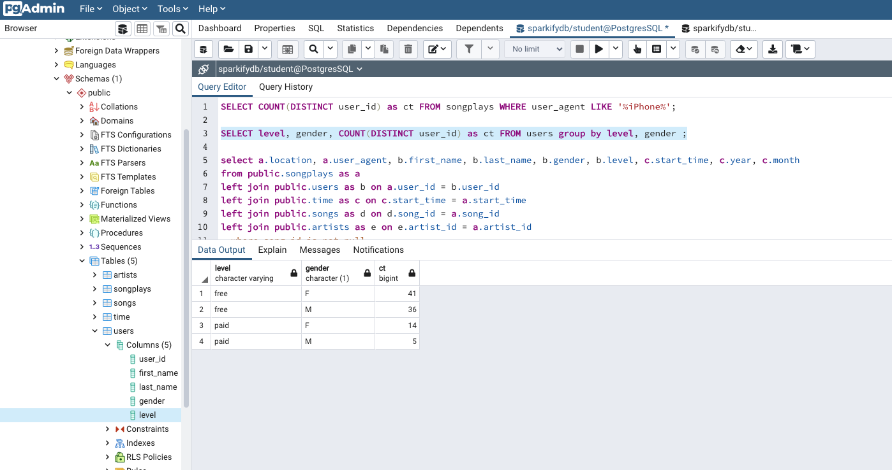

# Project: Data Modeling with Postgres

_This repository contains the results of the "Data Modelling with Postgres" Project which is part of the Udacity Data Engineering Nanodegree._

## Introduction
A startup called **Sparkify** wants to analyze the data they've been collecting on songs and user activity on their new music streaming app. The analytics team is particularly interested in understanding what songs users are listening to. Currently, they don't have an easy way to query their data, which resides in a directory of JSON logs on user activity on the app, as well as a directory with JSON metadata on the songs in their app.

They'd like a data engineer to create a Postgres database with tables designed to optimize queries on song play analysis, and bring you on the project.


## Project Description
In this project, I will apply what I learned in data modelling with Postgres and build an ETL pipeline using Python. To complete the project, I defined the fact and dimension tables for a star scheme for a particular analytical focus, and write an ETL pipeline that transfers data from files in two local directories to these tables in Postgres using Python and SQL.

## Data

The data sources (available locally), shared by Sparkify, are the following:

### Song Dataset
The first dataset is a subset of real data from the Million Song Dataset. Each file is in JSON format and contains metadata about a song and the artist of that song. The files are partitioned by the first three letters of each song's track ID. For example, here are filepaths to two files in this dataset.

```
song_data/A/B/C/TRABCEI128F424C983.json
song_data/A/A/B/TRAABJL12903CDCF1A.json
```

And below is an example of what a single song file, TRAABJL12903CDCF1A.json, looks like.

```json
{"num_songs": 1, "artist_id": "ARJIE2Y1187B994AB7", "artist_latitude": null, "artist_longitude": null, "artist_location": "", "artist_name": "Line Renaud", "song_id": "SOUPIRU12A6D4FA1E1", "title": "Der Kleine Dompfaff", "duration": 152.92036, "year": 0}
```

### Log Dataset
The second dataset consists of log files in JSON format generated by this [event simulator](https://github.com/Interana/eventsim) based on the songs in the dataset above. These simulate activity logs from a music streaming app based on specified configurations.

The log files in the dataset are partitioned by year and month. For example, here are filepaths to two files in this dataset.

```
log_data/2018/11/2018-11-12-events.json
log_data/2018/11/2018-11-13-events.json
```

## Schema for Song Play Analysis
Using the song and log datasets, I created a star schema optimized for queries on song play analysis.


This model, includes the following tables:

<br/>

### Fact Table
`songplays` - records in log data associated with song plays i.e. records with page NextSong
* _songplay_id, start_time, user_id, level, song_id, artist_id, session_id, location, user_agent_

<br/>

### Dimension Tables
`users` - users in the app
* _user_id, first_name, last_name, gender, level_

`songs` - songs in music database
* _song_id, title, artist_id, year, duration_

`artists` - artists in music database
* _artist_id, name, location, latitude, longitude_

`time` - timestamps of records in songplays broken down into specific units
* _start_time, hour, day, week, month, year, weekday_

<br/>

Principal advantages of using this Star Schema:

* Denormalized tables
* Easy for Sparkify users to understand
* Query performance
* Fast aggregation

The above schema allows in a very quick and easy way to obtain aggregations to answer different questions such as: what songs are most heard? what is the duration? which users listen to these songs? which are the artists? etc...).

<br/>

## ETL Process
To “_feed_" the final data model, it was necessary to implement the ETL process `etl.py` to extract the data, transform the data and finally load in final tables.

The summary of ETL process is below:
1. `process for songs table`: _process responsible for reading the json files dynamically, using the pandas. Selecting song attributes and executing data insertion queries in the final table. It is executed N times while files are required to process._

2. `process for artists table`: _process responsible for reading the json files dynamically, using the pandas. Selecting artists attributes and executing data insertion queries in the final table. It is executed N times while files are required to process._

3. `process for time table`: _process responsible for reading the log json files dynamically, using the pandas. Filter by "next song" action and convertion timestamp column. Extraction the date and time columns from dataframe, and executing data insertion queries in the final table. It is executed N times while log files are required to process._

4. `process for users table`: _process responsible for reading the log json files dynamically, using the pandas. Filter by "next song" action and convertion timestamp column. Selecting users attributes and executing data insertion queries in the final table. It is executed N times while log files are required to process._

5. `process for songsplays table`: _process responsible for reading the log json files dynamically, using the pandas. Filter by "next song" action . select the columns (keys for the dimensions and facts) and executing data insertion queries in the final table. It is executed N times while log files are required to process._

<br/>

## Project repository structure
The following folders and files are contained in the project repository:

```
postgres-data-modeling
│   README.md                          # Project description and documentation
│   .gitignore                         # Files and extension ignored in commited
│   docker-compose.yml                 # Container for postgres and pgadmin
│   requirements.txt        
│
└───data                               # Locally data source (json files)
│   └───log_data
│   │   │   ...
│   │
│   └───song_data
│       │   ...
│   
└───resources                          # Project resources (images, others...)
│     │   star-schema-design.png        
│     │   database-pgadmin.png
│   
└───src                                # Source code
│   └───notebooks                      # Jupyter notebooks
│   │   |   test.ipynb
│   │   |   etl.ipynb
│   │   |   data_exploration.ipynb
│   └───scripts                        # Python code
│       |   create_tables.py
│       |   etl.py 
│       |   sql_queries.py
```

<br/>

The main files:

* `test.ipynb` displays the first few rows of each table to check db.

* `etl.ipynb` reads and processes a single file from song_data and log_data and loads the data into final tables. This notebook contains detailed instructions on the ETL process for each of the tables.

* `data_exploration.ipynb` notebooks which make it possible to explore the data and present some statistical data on them. I present some graphs.

* `sql_queries.py` contains all sql queries, and it's used (imported) in other files or scripts.

* `create_tables.py` drops and creates your tables. This file should always be executed before running the ETL scripts. The db should be cleaned.

* `etl.py` reads and processes files from song_data and log_data and loads them into final tables.

<br/>

## Requirements

The following tools and packages are necessary to run the scripts locally:

* Git
* Python3
* Requirements
* Docker
* Docker-Compose
    * _PostgresSQL_
    * _PgAdmin_

<br/>

## How to use the Repository (for running locally in your machine)

<br/>

**Clone repository**

``` bash
git clone https://github.com/dacosta-github/udacity-de.git 
```

<br/>

**Change directory to local repository**

```bash
cd postgres-data-modeling
```

<br/>

**Start postgres and pgadmin docker container**

_Run this command in new terminal window or tab_

```bash
docker-compose up
```

_check containers_
```bash
docker ps # run in new terminal
```

<br/>

**Create and active python virtual environment**

_Run these following commands in new terminal window or tab_
```bash
python3 -m venv python-venv            
source python-venv/bin/activate 
```

<br/>
   
**Install requirements**

```bash
pip install -r requirements.txt  
```

<br/>

**Run the DDL and ETL scripts**

```bash
cd src
cd scripts
python -m create_tables  # create database schema DDL
python -m etl            # load one file per commit ETL
```

_Log obtained after execution:_
```bash
(python-venv) user@user scripts % python -m etl

71 files found in ../../data/song_data
1/71 files processed.
2/71 files processed.
3/71 files processed.
4/71 files processed.
5/71 files processed.
6/71 files processed.
7/71 files processed.
8/71 files processed.
9/71 files processed.
10/71 files processed.
11/71 files processed.
12/71 files processed.
13/71 files processed.
14/71 files processed.
15/71 files processed.
16/71 files processed.
17/71 files processed.
18/71 files processed.
19/71 files processed.
20/71 files processed.
21/71 files processed.
22/71 files processed.
23/71 files processed.
24/71 files processed.
25/71 files processed.
26/71 files processed.
27/71 files processed.
28/71 files processed.
29/71 files processed.
30/71 files processed.
31/71 files processed.
32/71 files processed.
33/71 files processed.
34/71 files processed.
35/71 files processed.
36/71 files processed.
37/71 files processed.
38/71 files processed.
39/71 files processed.
40/71 files processed.
41/71 files processed.
42/71 files processed.
43/71 files processed.
44/71 files processed.
45/71 files processed.
46/71 files processed.
47/71 files processed.
48/71 files processed.
49/71 files processed.
50/71 files processed.
51/71 files processed.
52/71 files processed.
53/71 files processed.
54/71 files processed.
55/71 files processed.
56/71 files processed.
57/71 files processed.
58/71 files processed.
59/71 files processed.
60/71 files processed.
61/71 files processed.
62/71 files processed.
63/71 files processed.
64/71 files processed.
65/71 files processed.
66/71 files processed.
67/71 files processed.
68/71 files processed.
69/71 files processed.
70/71 files processed.
71/71 files processed.

30 files found in ../../data/log_data
1/30 files processed.
2/30 files processed.
3/30 files processed.
4/30 files processed.
5/30 files processed.
6/30 files processed.
7/30 files processed.
8/30 files processed.
9/30 files processed.
10/30 files processed.
11/30 files processed.
12/30 files processed.
13/30 files processed.
14/30 files processed.
15/30 files processed.
16/30 files processed.
17/30 files processed.
18/30 files processed.
19/30 files processed.
20/30 files processed.
21/30 files processed.
22/30 files processed.
23/30 files processed.
24/30 files processed.
25/30 files processed.
26/30 files processed.
27/30 files processed.
28/30 files processed.
29/30 files processed.
30/30 files processed.
```
<br/>


**Check results**

_This command launches the **Jupyter Notebook** application and opens an installation in the browser automatically. Afterwards, you should navigate to the notebook folder and open the `test.ipynb`. notebook later is able to run the code._

```bash
cd src
cd notebooks
jupyter notebook     # http://127.0.0.1:8888/?token=XXXXXXXXXXXXXXX
```
<br/>

**Exploring the database**
_You should open the following link in your web browser:_

```bash
http://localhost:5555/browser/     # Email: student@pgadmin.org | Password: student
```
<br/>



<br/>

**Cleaning virtual environment:**

After all validations you can delete the created environments (python and docker). To do this, use the following commands:


On the same terminal as the python env, execute:

```bash
ctrl+c # to close Jupyter Notebook instance, use Ctrl+C in the terminal
```

```bash
cd ..
cd postgres-data-modeling
deactivate
rm -r python-venv
```

On the same terminal as the docker, execute:

```bash
ctrl+c  # to close Docker Containers, use Ctrl+C in the terminal
```

```bash
docker ps
docker kill
docker system prune -a  # select y
```

```bash
docker volume ls
docker volume rm postgres-data-modeling_postgres-data # postgres-data
```

```bash
docker network ls
docker network rm postgres-compose-network # postgres-compose-network
docker network prune  # select y
```

## Acknowledgements

* Star schema created on [erdplus](https://erdplus.com/standalone).

* Songs data set on [million song dataset](http://millionsongdataset.com).

* Udacity [Rubric](https://review.udacity.com/#!/rubrics/2500/view).

* Running Cassandra and Postgres in Docker [Rubric](https://www.cross-validated.com/Running-Cassandra-and-Postgres-in-Docker).

<br/>


